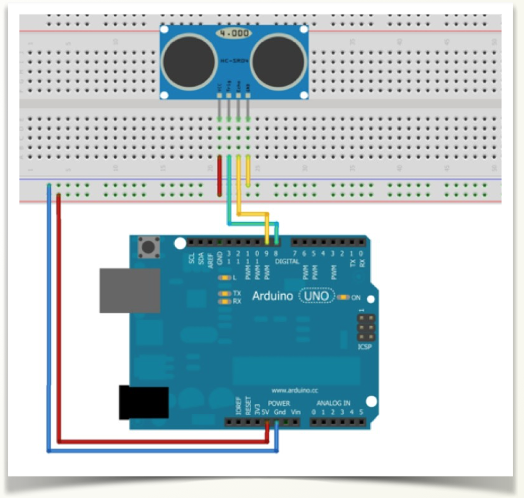

#Medición con LCD

Vamos a repetir el anterior programa pero que lo visualice el LCD

https://www.youtube.com/watch?v=eZvLMnHBypQ&feature=youtu.be


##Conexión: 
Conectar el sensor de Ultrasonidos



Y el LCD


##Código

```cpp+lineNumbers:true
#include <Wire.h>
#include <LiquidCrystal_I2C.h>

LiquidCrystal_I2C lcd(0x3F,16,2); ////Crear el objeto lcd dirección 0x3F y 16 columnas x 2 filas

int trigPin = 8;
int echoPin = 9;
float duration; //tiempo de ida/vuelta
float cm=0; //Para almacenar el valor obtenido en cm valor=0

void setup() {

  Serial.begin(9600);
  pinMode(trigPin, OUTPUT);
  pinMode(echoPin, INPUT);
  
  // Inicializar el LCD
  lcd.init();
  lcd.backlight(); //Encender la luz de fondo.
  
}

void loop() {
 //ponemos al trigger a low para activarlo después 
 digitalWrite(trigPin, LOW);
 delayMicroseconds(2);
 //Activar el módulo con un pulso de 10microsec.
 digitalWrite(trigPin, HIGH);
 delayMicroseconds(10);
 digitalWrite(trigPin, LOW);
 //Esperamos la llegada de un pulso HIGH
 duration = pulseIn(echoPin, HIGH);
 //tiempo de ida y vuelta, dividimos por 2
  duration=duration/2;
  //La velocidad del sonido es de 340 m/s
  //es decir, 29 microsegundos por centímetro
  cm = duration/ 29;
  lcd.setCursor(0, 0); // Escribimos el Mensaje en el LCD en una posición 1,0
  lcd.print("Distancia:");
  lcd.setCursor(0, 1); // Escribimos el Mensaje en el LCD en una posición 1,0
  lcd.println(cm);
  lcd.println(" cm ");
  delay(100);
}
```


