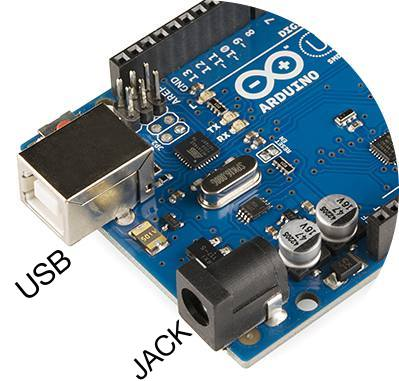

# Alimentación eléctrica de Arduino

Uno de los aspectos claves para el buen funcionamiento de proyectos con Arduino que incluyan elementos que consuman una intensidad superior a 200 mA como motores, relés, electroválvulas, etc... es la alimentación eléctrica de la placa. Normalmente tenemos dos posibilidades para alimentar Arduino:

**Mediante el cable USB conectado al ordenador:**

- Cada pin proporciona 40 mA.
- El límite proporcionado por el USB es de 500 mA en total.

**Utilizando una fuente de alimentación externa conectada al jack de Arduino (fuente de voltaje, adaptador de corriente, batería o portapilas) :**

- El voltaje recomendado de la fuente externa está entre 9 y 12 V.
- La intensidad máxima que puede entregar Arduino a los actuadores que queramos controlar (servos, motores, relés,...) es de 1A, aunque una exposición prolongada a esta corriente puede estropear la placa. Lo recomendable son 800 mA.
- El pin serigrafiado con Vin proporciona directamente el voltaje de la fuente conectada al jack de Arduino (menos la caída de tensión del diodo de protección), desde ese pin podemos sacar un cable y alimentar a los actuadores que necesitemos. Por ejemplo, si alimentamos con una pila externa de 9 V conectada al jack, en el pin Vin tendremos aproximadamente 9 V (hay que restar la caída de tensión del diodo de protección). Además en los pines 5V y 3.3V dispondremos también de dichos voltajes aunque la fuente externa sea de 9V.

Si conectamos demasiada carga, la placa Arduino suele tener un comportamiento anómalo pudiéndose se resetear el micro.

**Conectando el positivo (+Vcc) de la fuente externa a Vin y el negativo a GND:**

Podemos alimentar Arduino externamente si necesidad de conector Jack a través de Vin y GND el problema es que nos saltamos un diodo de protección que evita  que se queme el circuito por un exceso de corriente.

**CONCLUSIÓN:**

- Si necesitamos hacer funcionar actuadores de bajo consumo (luces, zumbadores, etc...) podremos trabajar directamente con el USB conectado al ordenador.
- Si necesitamos mover cargas, excitar bobinas u otros elementos de mayor consumo lo recomendable es alimentar externamente Arduino desde el Jack con un rango de 9 a 12 V.

