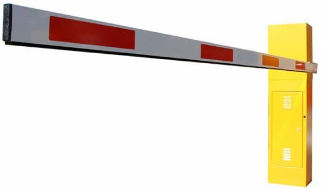

# Barrera

Vamos ahora a realizar UN PROYECTO donde englobamos varios de los elementos que hemos visto en este curso, algo que visualmente tenga un sentido práctico y motivador en el alumnado

Utilizaremos:

- Placa Shield de Edubásica (optativo) por facilitar las conexiones
- Servo motor
- Dos sensores de ultrasonidos
- Módulo Bluetooth
- Imaginación y maña

