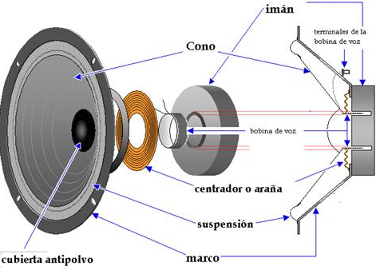

# Bobinas-altavoz

El altavoz es una simple bobina o electroimán que mueve una membrana, si la membrana se mueve repetidamente puede producir un sonido.

Este sonido es audible si está dentro de nuestro rango auditivo, suele ser entre 20Hz y 20kHz

> ¿Sabías que a medida que creces el margen de agudos \(20kHz\) baja?

<iframe src="https://giphy.com/embed/4njYZD26XnY7C" width="480" height="360" frameBorder="0" class="giphy-embed" allowFullScreen></iframe>
<a href="https://giphy.com/gifs/4njYZD26XnY7C">via GIPHY</a>

