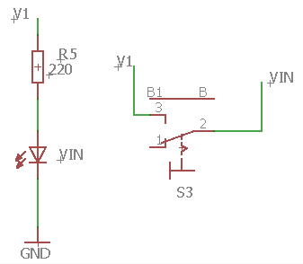
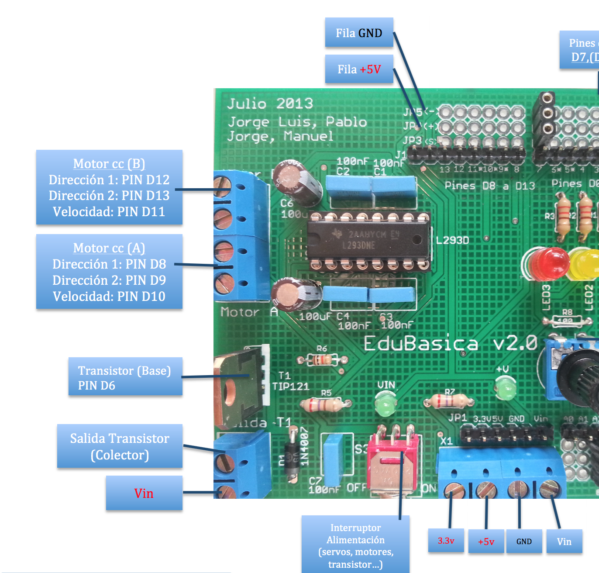

# Con Edubásica

Edubásica es una tarjeta diseñada para facilitar la tarea en el aula. Elimina gran parte de cableado y conexiones en la placa de pruebas lo que evita muchos errores en las prácticas. 

En esta placa disponemos de las dos opciones vistas anteriormente. Edubásica lleva montados, entre otros componentes, un circuito integrado L293 y un transistor. Por lo tanto podemos activar motores **usando ambas opciones**, aunque lo recomendable es utilizar el L293 que permite el cambio de sentido de giro y regular la velocidad actuando con una señal PWM sobre los dos pines de habilitación (dependiendo de la hoja de datos viene como ENABLE o CHIP INHIBIT)  del circuito L293. Los pines de Arduino que pueden regular la velocidad por PWM correspondientes a esas patillas de habilitación serán: D10 para el motor A y D11 para el motor B.

Para hacer funcionar dos motores DC con Edubásica sólo tenemos que conectar en las clemas indicadas (serigrafiados en la placa como Motor A y Motor B) los dos cables de cada motor. Según se observa en la imagen, tenemos 4 conexiones para los dos motores. Desde Arduino y con la [tabla de verdad](sin_edubsica.html) del CI L293 indicada en la sección anterior,  podemos regular el sentido de giro y velocidad de cada motor.

Edubásica lleva un interruptor que permite tomar el voltaje de la salida Vin de Arduino (alimentación externa), necesaria para dar la corriente suficiente para accionar los motores. Cuando el piloto Vin está encendido significa que la alimentación de Edubásica viene de Vin de Arduino, o bien, directamente desde una fuente externa conectada a la clema Vin de Edubásica de la regleta de alimentación (en la imagen la regleta de la parte inferior).

Es muy fácil, podemos conectar hasta dos motores en los pines dispuestos para ello, y utilizaremos:

- Para el motor A el control de velocidad por el pin 10 y las direcciones por 8 y 9
- Para el motor B el control de velocidad por el pin 11 y las direcciones por 12 y 13.
- Interruptor en ON

Conectando los dos terminales del motor a la clema del transistor de Edubásica, también podríamos hacerlo funcionar enviando un nivel HIGH al pin digital 6 de Arduino.  Este pin (D6) está conectado directamente a la base del transistor de Edubásica. La desventaja respecto al CI L293 es que, en este caso, no podríamos cambiar el sentido de giro.

