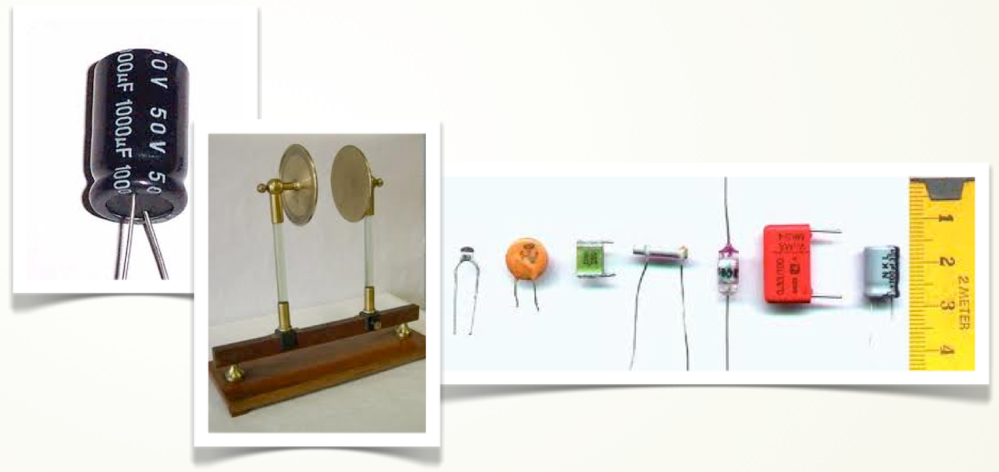

# Condensadores

Dos conductores cualesquiera separados por un aislante constituye un condensador. Este tipo de dispositivos eléctricos tienen gran variedad de usos como filtrar señales, eliminar ruido eléctrico o almacenar carga eléctrica entre otros.

En casi todas las aplicaciones prácticas cada conductor se encuentra inicialmente descargado y al conectarlos a una batería, mediante transferencia de carga de la batería a los conductores, van adquiriendo una cierta carga (dicho proceso se denomina carga del condensador). En todo momento, ambos conductores tienen igual carga pero de signo opuesto de tal forma que entre ambos conductores existe un campo eléctrico y por tanto una diferencia de potencial que se opone a la externa responsable de su carga. El proceso de carga del condensador se detiene cuando la diferencia de potencial entre los conductores del mismo se iguala a la de la batería. 

Hay que resaltar que aunque cada placa se encuentra cargada, la carga neta del condensador sigue siendo nula, puesto que la carga de cada conductor es igual a la del otro pero con signo contrario. Es por ello que cuando se dice que un conductor tiene una carga Q realmente lo que se está diciendo es que tiene una carga +Q en el conductor que se encuentra a mayor potencial y una carga – Q en el conductor a menor potencial (supuesto Q positiva).

****

