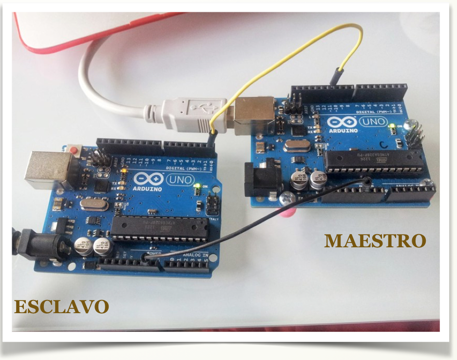

# Conexión entre dos Arduinos por cable

Podemos conectar dos placas Arduino de distintas maneras: Bluetooth, Xbee, Ethernet, WIFI...

Pero la forma más sencilla es aprovechar la conexión para la comunicación serie que ya posee Arduino.

# Conocimiento previo

- Programación básica de Arduino.
- Bucles **for, **sentencias if-else, switch-case.

# Objetivos

- Comunicación serie.
- Configuración maestro / esclavo.
- Crear un nuevo puerto serie.

Lista de materiales:

- 2 placas Arduino.

SI NO DISPONES DE DOS PLACAS DE ARDUINO, TE PROPONEMOS SIMULARLO

