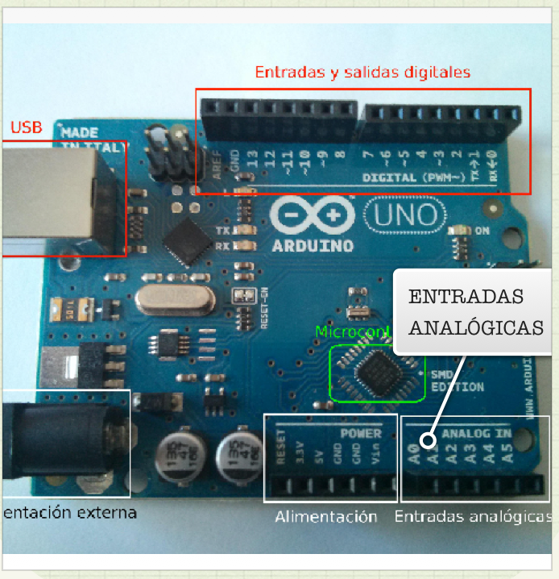

# Conexiones analógicas

Las entradas analógicas se utilizan para leer la información de la magnitud física que nos proporciona los sensores de temperatura, luz, distancia,... La tensión que leemos del sensor no la proporciona un circuito asociado a dicho sensor en un rango de valores de tensión continua entre 0V y 5V.

La placa de Arduino tiene 6 entradas analógicas marcados como “A0”, “A1”,..., “A5” que reciben los valores continuos en un rango de 0V a 5V, pero la placa Arduino trabaja sólo con valores digitales, por lo que es necesario una conversión del valor analógico leído a un valor digital. La conversión la realiza un circuito analógico/digital incorporado en la propia placa.

El conversor A/D de la placa tiene 6 canales con una resolución de 10 bits. Estos bits de resolución son los que marcan la precisión en la conversión de la señal analógica a digital, ya que cuantos más bits tenga más se aproxima al valor analógico leído. En el caso de la placa Arduino el rango de los valores analógicos es de 0 a 5 V y con los 10 bits de resolución se puede obtener de 0 a 1023 valores digitales y se corresponde cada valor binario a (5V/1024) 5 mV en el rango analógico.

En estas condiciones son suficientes para hacer muchos proyectos tecnológicos. En el caso de necesitar mayor resolución y como no podemos aumentar el número de bits de conversor A/D se puede variar el rango analógico utilizando el voltaje de referencia Vref.

Las entradas analógicas tienen también la posible utilización como pines de entrada-salida digitales, siendo su enumeración desde 14 al 19.

En este manual dedicamos un capítulo completo a analizar la forma en que Arduino lee magnitudes analógicas. Asimismo veremos numerosos montajes en los que se utilizan estos pines para lectura de sensores.

