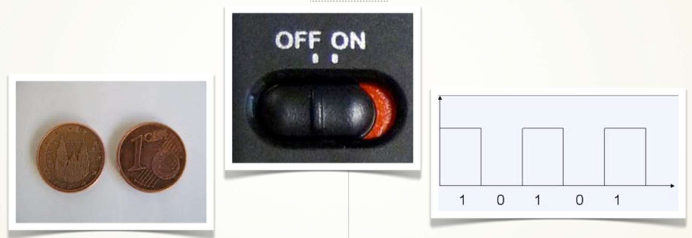

# Conexiones digitales

En este apartado aprenderemos el funcionamiento básico de las entradas y salidas digitales de la placa Arduino. Si observamos bien la placa, vemos que hay 13 pines digitales. 

En este caso la señal digital no es más que un valor discreto de entre dos posibles, que si en rigor se asocian a tensiones, nosotros por sencillez los asociaremos a dos valores que serán ,apagado o encendido o lo que es lo mismo  LOW ó HIGH.

Así si asignamos un 0 al pin digital 4, es lo mismo que decir que ese pin, o mejor dicho, lo que esté conectado a ese pin estará apagado si le asignamos un 1, estamos diciendo que estárá encendido.

Entonces, ¿Con los 13 pines digitales de Arduino , podríamos actuar para controlar 13 bombillas? . Si, aunque Arduino es aún más potente ya que aún podemos usar los 5 pines analógicos también como salidas digitales.

Veamos como.

