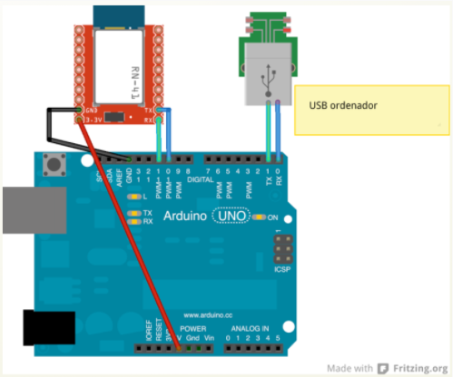

# Configuracion avanzada

Si quieres modificar cosas como la velocidad de conexión, el nombre o la contraseña de tu módulo, aquí te dejamos un código para que subas a tu arduino y mediante el monitor serie lo configures.

>Nota: No se pretende que realices el montaje, pero creemos que es importante que veas que el módulo Bluetooth no es cerrado en su configuración.

Para ello hemos creado un nuevo puerto serie para que no interfiera con el USB y podamos usarlo simultáneamente, lo haremos en las patillas 10 y 11.

 Deberás conectar el módulo como ves en la figura, y luego cargar el código. Una vez súbido, abre la consola serie y (EN MAYÚSCULAS) ejecuta los comandos que necesites.

Una vez finalizado, puedes desconectar el módulo BT y usarlo con normalidad.



```cpp
#include <SoftwareSerial.h>
   SoftwareSerial Serial1(11, 10); 
   //10:TX DEL MODULO, 11:RX DEL MODULO
   String command = ""; // guardará la respuesta desde el BT
   void setup()  
   {
     Serial.begin(9600);  //CONEXION SERIE USB CON ORDENADOR
     Serial1.begin(9600); //CONEXION SERIE PARA EL MODULO BT
     Serial.println("Terminal para configurar BT(JY-MCU)");
     Serial.println("Comandos AT. USA MAYUSCULAS");
     Serial.println("-----------------------------------");
     Serial.println("Comando, Respuesta, Paramentros");
     Serial.println("AT, OK,--Verifica la conexión--");
     Serial.println("AT+VERSION,--Devuelve la version--");
     Serial.println("AT+BAUDx, OKxxxx, Set x to: 1=1200 \
2=2400 3=4800 4=9600 5=19200 6=38400 7=57600 8=115200 \
 --para cambiar la velocidad--");
     Serial.println("AT+NAMEstring, nombrenuevo (20max)");
     Serial.println("AT+PINxxxx, Cambia el pin (1234 por defecto)");
     Serial.println("AT+ROLEx,1=MASTER/0=SLAVE --SOLO MASTER");
     Serial.println();
   }

void loop()
   {
     //Chequear si hay datos desde BT
	if (Serial1.available()) {
     while(Serial1.available()) { 
         command += (char)Serial1.read();
       }
       Serial.println(command);
       command = ""; 
     }
     //Chequear si hay datos desde USB
     if (Serial.available()){
         delay(10); // necesita un pequeño delay
         Serial1.write(Serial.read());
     }
}
```