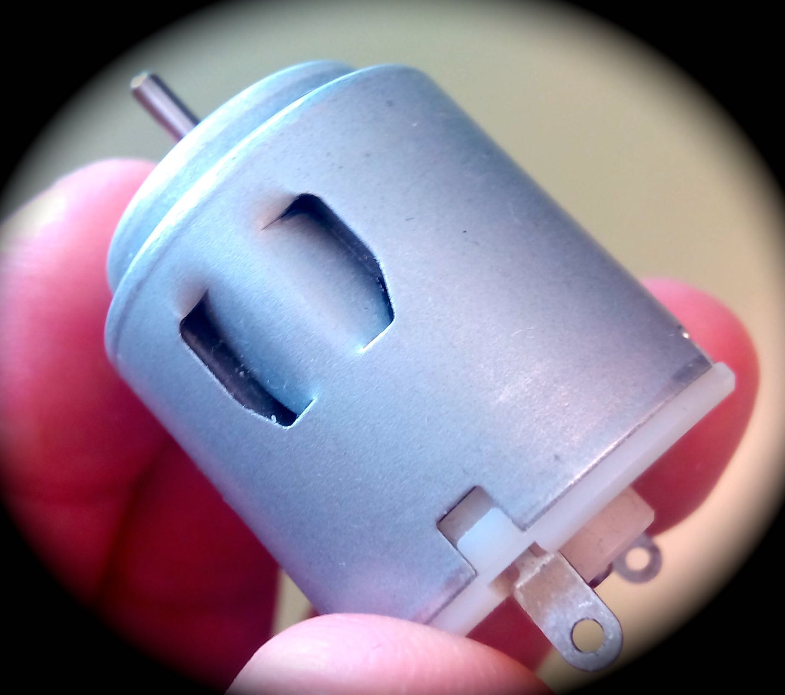

# Control de motores DC

### Alimentación

Como vimos en la sección de Alimentación eléctrica de Arduino no es recomendable alimentar Arduino, cuando se trabaja con elementos de "alto" consumo como pueden ser los motores DC, con el cable USB. Tenemos la posibilidad de proporcionar más (mili)amperios a través de la conexión jack de Arduino. En el pin Vin tendremos una salida del voltaje que apliquemos por el jack que servirá para alimentar a los motores a través del integrado mediante el pin 8 (VC ó Vcc2). Para ver los márgenes de voltaje de trabajo del CI consultar la hoja de datos del fabricante. 

Si el motor es pequeño y trabaja sin carga, sí que se puede.

Recomendamos las siguientes páginas de Luis Llamas:

- [Tipo de motores](https://www.luisllamas.es/tipos-motores-rotativos-proyectos-arduino/)
- [Motores paso a paso](https://www.luisllamas.es/motores-paso-paso-arduino-driver-a4988-drv8825/)

Para obtener más información sobre estas placas se puede consultar la web oficial de Arduino: [http://www.arduino.cc/en/Main/ArduinoMotorShieldR3 ](http://www.arduino.cc/en/Main/ArduinoMotorShieldR3%20)

Además de utilizar una shield específica de motores DC, tenemos otras posibilidades  para ponerlo en marcha:<b style="font-size: 0.82em; line-height: 1.5;"> </b>

- [Montaje con transistor.](montaje_con_transistor.html)
- [Conexión con circuito integrado L293](montaje_con_circuito_l293.html)
- [Shield Edubásica.](con_edubsica.html)

