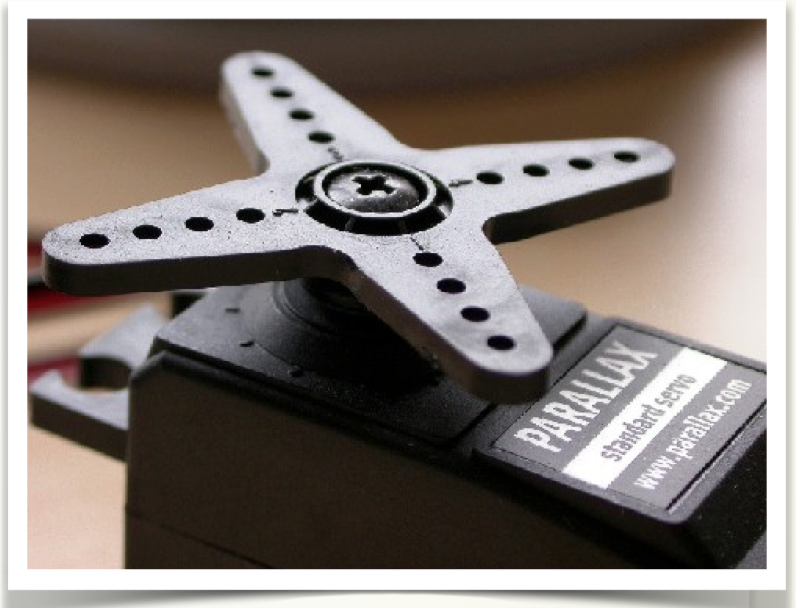

# Control de servomotores

Una de las aplicaciones más utilizadas de los sistemas de control por ordenador y en la robótica están asociados con los motores, que permiten accionar o mover otros componentes, como puertas, barreras, válvulas, ruedas, etc. Uno de los tipos que vamos a ver en este capítulo es el servomotor que posee la capacidad de posicionar su eje en un ángulo determinado entre 0 y 180 grados en función de una determinada señal. 

### Servos de rotación contínua

Son servos por fuera igual que los anteriores, pero pueden girar 360º y se controlan por tiempo, es decir servoRotCont.write(90);

---

Si quieres saber más sobre servomotores te recomendamos estas paginas del Zaragozano Luis LLamas:

- [Servomotores](https://www.luisllamas.es/controlar-un-servo-con-arduino/) convencionales
- Servomotores de [rotación continua](https://www.luisllamas.es/controlar-un-servo-de-rotacion-continua-con-arduino/)

Recomendamos testear tus servos en el [Montaje 1](montaje_1_testea_tu_servo.html).

---

# Conocimiento previo

- Programación básica de Arduino.
- Uso de librerías internas de Arduino (Servo.h).
- Bucles **for.**

# Objetivos

- Conocer qué es un servomotor, tipos y funcionamiento.
- Las aplicaciones en el mundo de la automática y el control por ordenador de este tipo de motores.
- Usar la librería que incorpora Arduino para controlar los servos.

Lista de materiales:

- Servomotor.
- Placa Arduino UNO.
- Placa EduBásica (opcional).