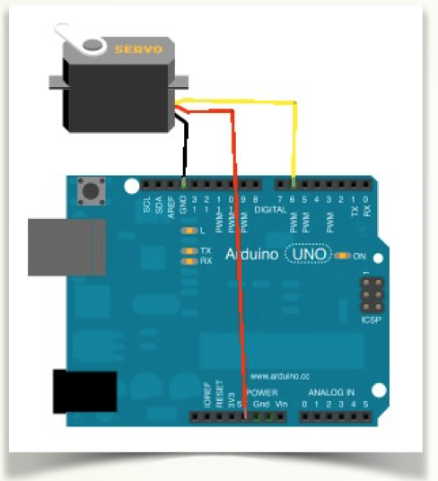

# Descripción y esquemas

Los servos son un tipo especial de motor en el que se añade una circuito lógico electrónico que permite un control mucho más preciso que a un motor normal de corriente continua. Los servomotores se utilizan para posicionar el eje en un ángulo determinado.

El hardware interno se compone de un potenciómetro y un circuito integrado que controlan en todo momento los grados que gira el motor. De este modo, en nuestro caso, desde Arduino, usando las salidas digitales PWM podremos controlar fácilmente un servo.

La conexión se realiza mediante 3 cables: 2 de alimentación (+5V/GND) y un tercero, conectado por ejemplo el 6 marcado como PWM según se observa en el esquema de conexiones, donde indicaremos los grados que queremos que gire a través de un programa en Arduino.

En Edubásica tenemos una forma muy sencilla de conectar un servo a la tarjeta. Lo puedes hacer mediante las clavijas identificadas con JP3.

De arriba abajo las conexiones son:

- Señal (pin7)
- +5V
- GND

Recuerda que siempre puedes utilizar los pines analógicos como E/S digitales, del pin 14 al 19.

Por ejemplo, puedes conectar el servo al pin analógico 5, pero declarado como digital en el 19.

