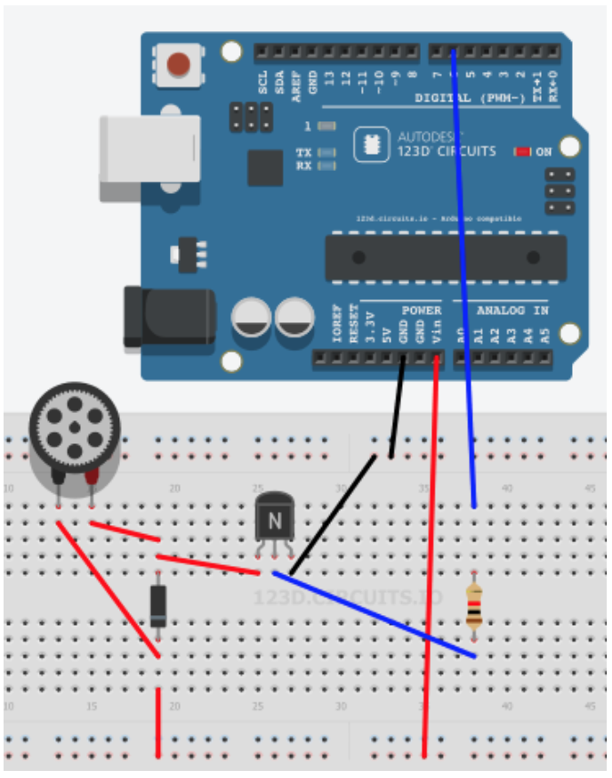

# Descripción y esquemas

### CON EDUBÁSICA

La shield de Edubásica ya tiene incorporado el transistor y los diodos de protección para funcionar el motor, para ello tenemos que hacer:

- Poner el interruptor en ON
- Conectar el motor en la salida del transistor y Vin
- Utilizar D6 como pin de control del motor

### SIN EDUBASICA

Desde Arduino (salida digital) actuamos sobre la base si enviamos un HIGH al pin digital donde la conectemos (pin 6 en el esquema). El transistor tiene que tener suficiente ganancia. Se conecta un diodo de protección en antiparalelo (1N004). Cuando el motor se para las bobinas se desmagnetizan y se descargan de energía eléctrica. El diodo proporciona un camino para su descarga (la energía se disipa en forma de calor en el diodo) y así se evita que sufra el transistor.

Otra posibilidad que protege el transistor es, en vez de conectar directamente el motor al colector del transistor, ubicar un relé en esa posición y accionar el motor con alimentación independiente con la conmutación del relé. Este ejercicio se propone en la sección de actividades.

Ejemplo de montaje con TIP121 (NPN, par Darlington *): 

* Datasheet: https://www.fairchildsemi.com/datasheets/TI/TIP120.pdf

