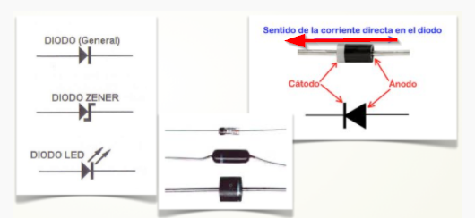
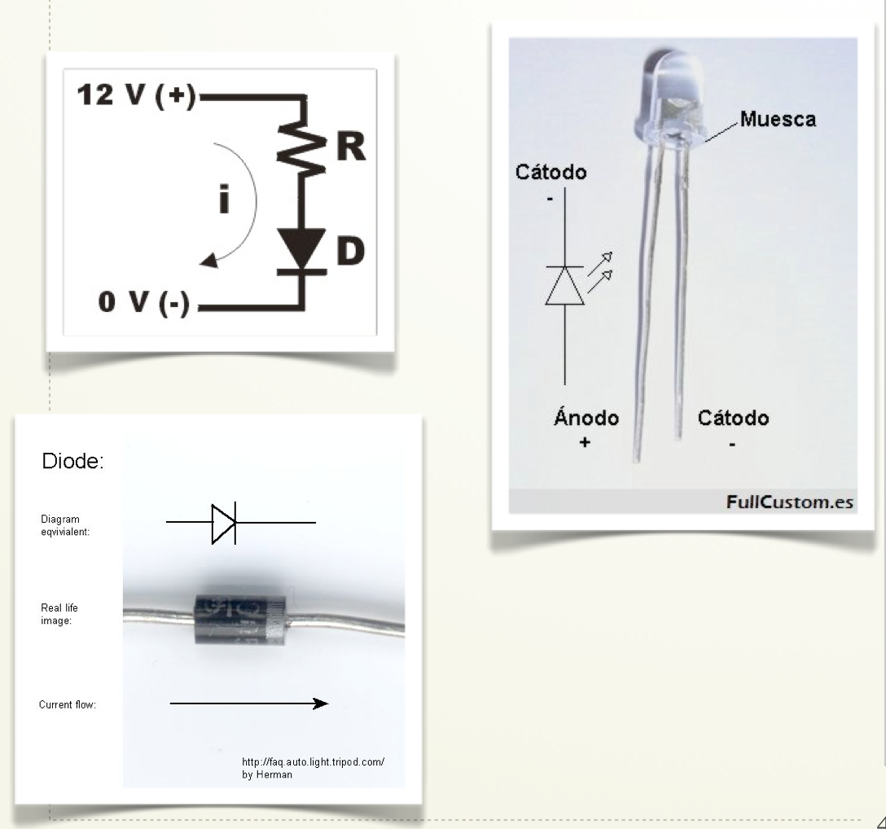
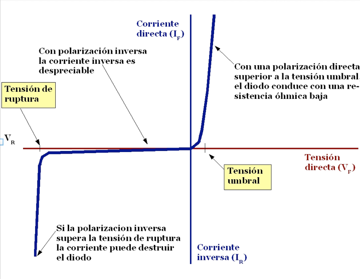

# Diodos

Seguro que has oído hablar de los diodos LED (Light-Emitting Diode) pues están muy de moda. Un diodo led no es más que un diodo que emite luz cuando está polarizado correctamente.

Un diodo (del griego "dos caminos") es un dispositivo semiconductor que permite el paso de la corriente eléctrica en una única dirección con características similares a un interruptor.

De forma simplificada, la curva característica de un diodo (I-V) consta de dos regiones: por debajo de cierta diferencia de potencial, se comporta como un circuito abierto (no conduce), y por encima de ella se comporta como un cortocircuito con muy baja resistencia eléctrica.

Veamos si sabes como polarizar un diodo...

Un diodo se dice polarizado directamente cuando su cátodo está a un potencial inferior al ánodo. Los diodos por tanto deben especificar cual es el ánodo y el cátodo. En la foto puedes ver como un diodo led identifica su cátodo con una patilla recortada.  En otro tipo de diodos se puede identificar el cátodo gracias a una raya dibujada sobre el componente.

## CURVA CARACTERÍSTICA DE UN DIODO:

Vamos a estudiar la curva I-V de un diodo de tal manera que comprobaremos que al aplicar un cierto voltaje el diodo conduce y no conduce (estado en corte) si estamos por debajo de ese voltaje o diferencia de potencial. En el caso específico de un diodo la diferencia de potencial a superar es de 0,7 V; si es un diodo LED es más del doble. A partir de ese valor conduce la corriente eléctrica y si es un LED, empieza a iluminarse.

