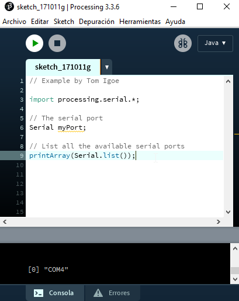
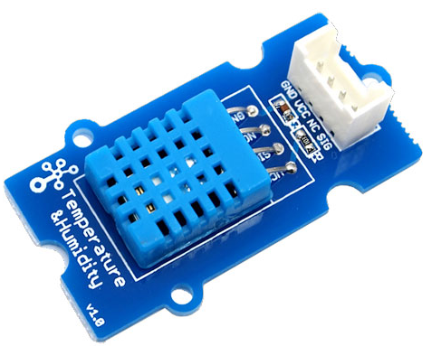

# Divisor de tensión

Muchas veces necesitamos sacar una tensión que no es la máxima de la alimentación (en este caso 5V) el truco es hacerlo por resistencias, en forma de divisor de tensión:

Si aplicamos la ley de Ohm podemos deducir la siguiente fórmula: [[aquí si quiere ver la demostración](https://programarfacil.com/blog/divisor-de-tension-en-arduino-multiplica-tus-entradas-digitales/)]

En este caso utilizaremos el divisor de tensión para demostrar que modificando la R2 por resistencias en serie o paralelo, se modifica la tensión Vout que el Arduino lo leerá y lo visualizará en un LED

