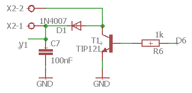
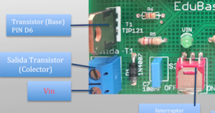
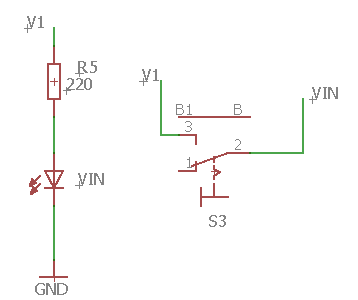

# En EDUBASICA

En la shield tenemos un[ TIP121 es un transistor NPN tipo "Darlington" ](https://alltransistors.com/pdfview.php?doc=tip121.pdf&amp;dire=_fairchild_semi)es decir, está integrado por dos transistores interiormente.

Los conectores X2-2 y X2-1 son los de abajo a la izquierda. **X2-2 es el colecto**r del transistor y **X2-1 es V1 **(aunque en la foto pone Vin):

V1 y Vin está conectado por el interruptor según este esquema:

Luego es mejor **que el interruptor esté conectado en ON** para unir V1 con Vin y cortar el diodo D1, en caso contrario se nos va la corriente de la resistencia de colector por D1 a R5 y al led engañando la medida.

Vin son aproximadamente 5V de potencia de entrada al arduino que se utilizan si no lo alimentamos por el USB. 

