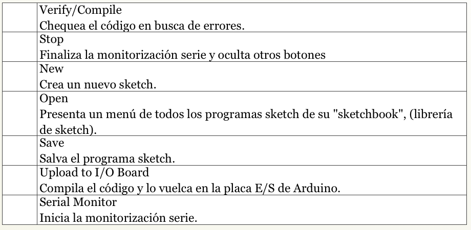
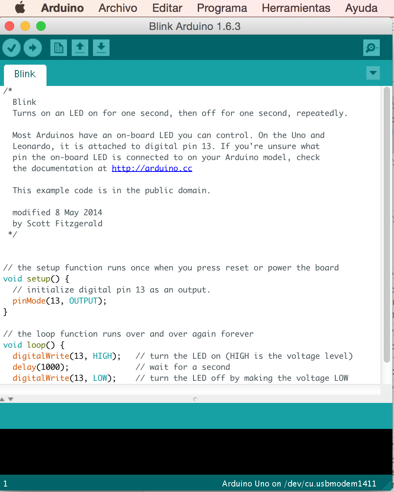
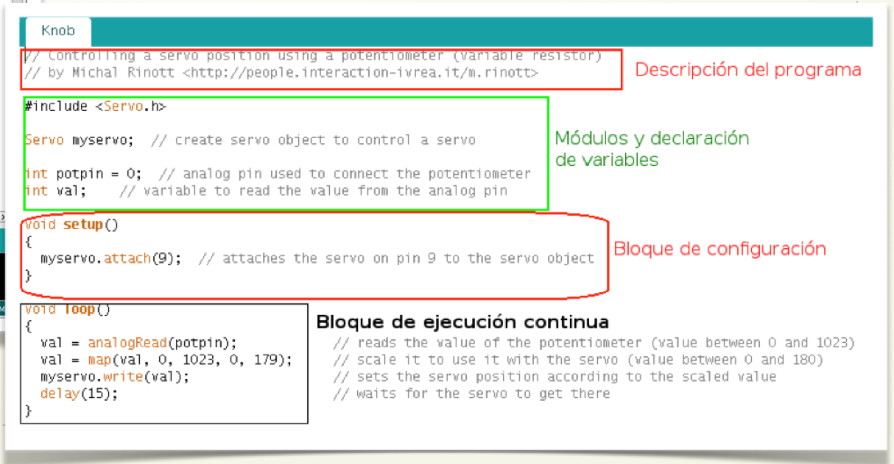

# Entorno de programación

El entorno de desarrollo Arduino (IDE,  Integrated development environment) está constituido por un editor de texto para escribir el código, un área de mensajes, una consola de texto, una barra de herramientas con botones para las funciones comunes, y una serie de menús. Permite la conexión, por USB, con el hardware de Arduino para cargar los programas y comunicarse con ellos. 

Arduino utiliza para escribir el código fuente o programa de aplicación lo que denomina "sketch" (programa). Estos programas son escritos en el editor de texto. Existe la posibilidad de cortar/pegar y buscar/remplazar texto. En el área de mensajes se muestra información mientras se cargan los programas y también muestra errores. La consola muestra el texto de salida para el entorno de Arduino incluyendo los mensajes de error completos y otras informaciones. La barra de herramientas permite verificar el proceso de carga, creación, apertura y guardado de programas, y la monitorización serie: 

Encontraremos otros comandos en los cinco menús: Archivo, Editar, Programa, Herramientas, Ayuda. Los menús son sensibles al contexto, lo que significa que estarán disponibles sólo los elementos relevantes para la tarea que esté realizando en ese momento.

## ¿Cómo se programa Arduino?

Las partes principales de un programa hecho en Arduino son: Bloque de inclusión de módulos y declaración de variables, bloque de configuración **void setup()** donde se indica el modo de funcionamiento de los pines (entrada y salida), comunicación serie, etc... y bloque de ejecución continua **void loop()**, en este bloque se incluyen las acciones que queremos que realice el programa. Se ejecutará línea a línea de forma secuencial y continua. Cuando llegue a la última instrucción incluída en la función **loop()** volverá a ejecutar la primera y continuará en un bucle infinito.

## ¿Arduino tiene que estar continuamente conectada a un ordenador?

Sólo es necesario que esté conectado al ordenador mediante el USB para cargar los programas o para visualizar en tiempo de ejecución datos del programa mediante la consola serie. El ordenador proporciona la energía eléctrica suficiente para que funcionen los programas, pero una vez cargado el programa en la memoria del microcontrolador de Arduino se puede desconectar del USB y alimentar a la tarjeta mediante una fuente externa mediante el jack de alimentación con un margen de (5 a 20 Voltios). El programa cargado en Arduino queda grabado permanentemente aunque cese el suministro eléctrico.

## **¿Qué voy a aprender con este manual?**

Aprenderás a realizar pequeños proyectos y prácticas cuya base de control es la tarjeta Arduino y en algunos casos la shield “Edubásica”. EDUBÁSICA es una tarjeta que se coloca sobre Arduino y lleva integrados muchos de los componentes básicos para realizar las prácticas de electrónica, y ciertos proyectos tecnológicos de una manera muy sencilla, aunque todas las prácticas se pueden implementar sin el uso de esta tarjeta.  La idea del manual es integrar los contenidos del currículo en 4º de Enseñanza Secundaria Obligatoria (alumnos de 15-16 años) con diferentes proyectos para que el alumno consiga un aprendizaje significativo de la Tecnología.

Para una mayor información y manejo de la instalación del entorno de programación, lenguaje de programación y librerías se encuentra en la página web de la comunidad Arduino:

[www.arduino.cc ](http://www.arduino.cc%20) (portal en inglés, más actualizada).

[www.arduino.es](http://www.arduino.es) (portal en español).

