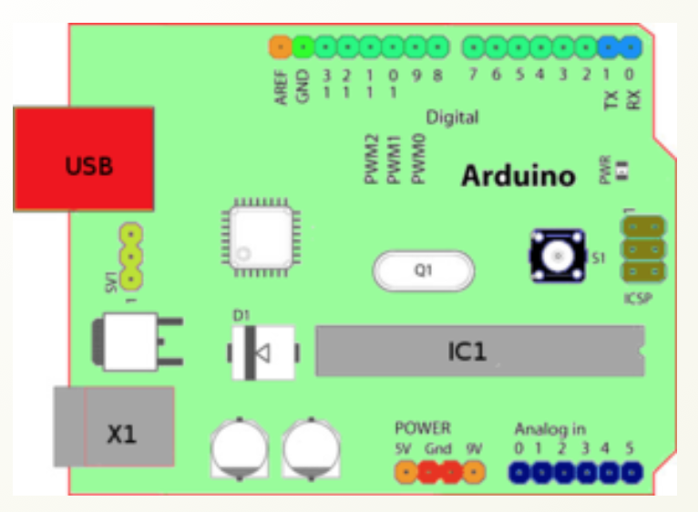
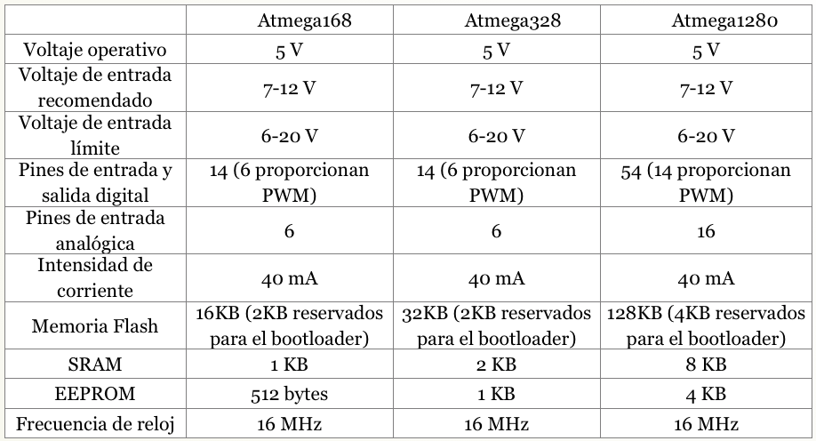
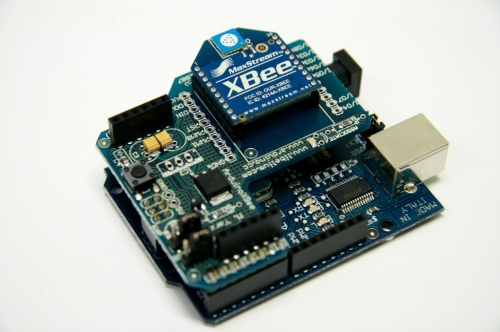
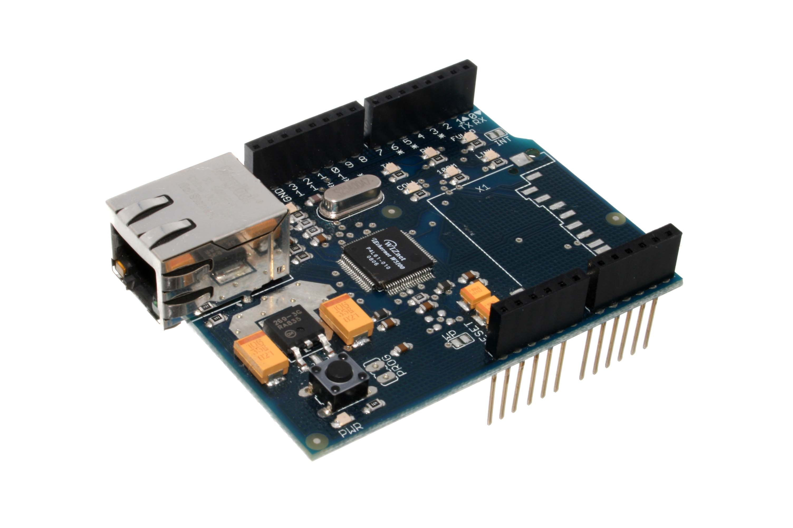
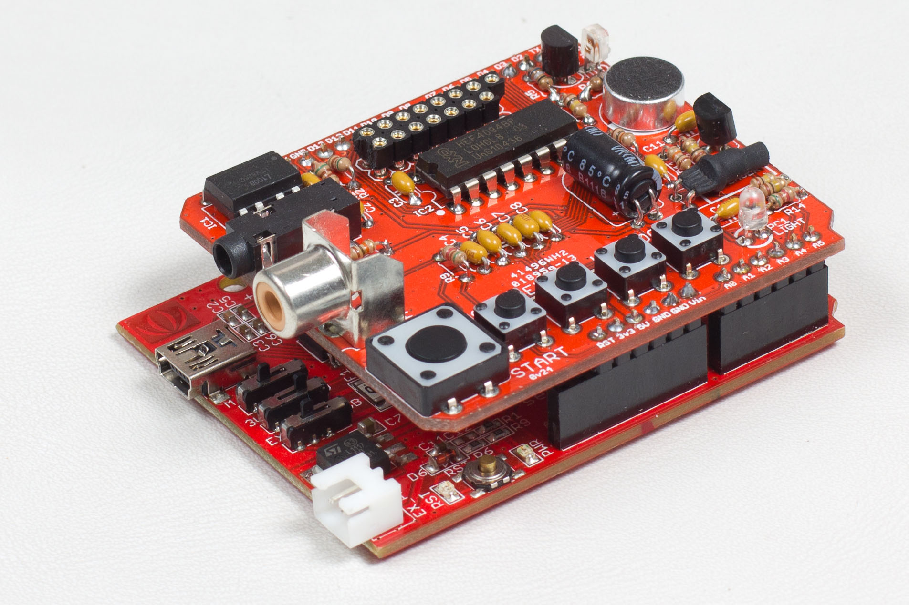

# Hardware

### Placa Arduino

Arduino puede tomar información del entorno a través de sus pines de entrada de toda una gama de sensores y puede afectar aquello que le rodea controlando luces, motores y otros actuadores. El microcontrolador en la placa Arduino se programa mediante el lenguaje de programación Arduino (basado en Wiring) y el entorno de desarrollo Arduino (basado en Processing).

###  Entradas y salidas

La placa Arduino Duemilanove o UNO consta de:

14 entradas digitales configurables Entrada/Salidas que operan a 5 ó 0 voltios. Cada pin puede proporcionar o recibir como máximo 40 mA. 

Los pines 3, 5, 6, 8, 10 y 11 pueden proporcionar una salida PWM (Pulse Width Modulation). Si se conecta cualquier dispositivo a los pines 0 y 1, eso interferirá con la comunicación USB. 

6 entradas analógicas con una resolución de 10 bits que proporcionan un número entero de 0 a 1023. Por defecto miden de 0 voltios (masa) hasta 5 voltios.

### Pines de la placa

Elementos con los que podemos interactuar: (tomando como ejemplo la placa USB). Empezando en el sentido de las agujas del reloj desde el centro de la parte superior:

- Pin de referencia analógica (naranja).
- Señal de tierra digital (verde claro).
- Pines digitales 2-13 (verde).
- Pines digitales 0-1 / entrada y salida del puerto serie: TX/RX (azul) (estándar de comunicación serie IC2).
- Botón de reset (negro).
- Entrada del circuito del programador serie (marrón).
- Pines de entrada analógica 0-5 (azul oscuro).
- Pines de alimentación y tierra (naranja y naranja claro).
- Entrada de la fuente de alimentación externa (9-12V DC) – X1 (gris).
- Conmutación entre fuente de alimentación externa o alimentación a través del puerto USB – SV1. En las placas más reciente la conmutación de la alimentación se realiza con un MOSFET.
- Puerto USB (rojo).

Las placas: Arduino Diecimila, Arduino Duemilanove o UNO y Arduino Mega están basados en los microcontroladores Atmega168, Atmega 328 y Atmega1280 respectivamente.

Las especificaciones de cada uno de los microcontroladores se exponen en la tabla siguiente:

### SHIELDS para Arduino

Las llamadas Shields (escudos) para Arduino son tarjetas que añaden funciones a la placa Arduino. 

Como se ha comentado antes, Arduino por sí sola no puede proporcionar la suficiente intensidad para alimentar motores, relés o electroválvulas. El límite de intensidad que proporciona cada una de las salidas digitales es de 40 mA. Para poder activar estos dispositivos tendremos que montar un circuito externo adicional con transistores o circuitos integrados específicos para motores, como es el caso del LM293, que entregan la intensidad suficiente. Para facilitarnos la tarea existen unas placas adaptadas a los pines de Arduino que se ensamblan directamente sobre ella a modo de "escudo" (de ahí su nombre, shileds) y nos permiten tener pines adicionales para alimentar las cargas que Arduino por sí solo no es capaz de mover.

Hay también otro tipo de "shields" que proporcionan funciones como conexión Ethernet, WIFI, XBee, GSM, Host USB, etc... Actualmente hay decenas de ellas en el mercado. Puedes encontrar una larga lista de ellas en [http://playground.arduino.cc/Main/SimilarBoards#goShie](http://playground.arduino.cc/Main/SimilarBoards#goShie)

Algunos ejemplos:

#### SHIELDS EDUCATIVAS

La shield de este curso **EDUBASICA**

La shield de [otro curso en CATEDU](https://catedu.gitbooks.io/programa-arduino-con-echidna/content/): **ECHIDNA**

#### SHIELD VISUALINO k5864195

Es una shield bastante barata, por 10€ placa Arduino+Shield Visualino y nos gusta porque tiene :

- 4 diodos LED
- 3 pulsadores
- 1 potenciómetro
- 1 zumbador
- 1 Display

O sea buena y barata. ¿Por qué seguimos apostanto por Edubásica? Por la posibilidad de Edubásica de poner motores y por lo tanto es más motivador. Echidna nos gusta porque tiene un Joistick, sensor de luz.. que también da juego gamificado.. en fin, Visualino es una buena opcion para Arduino básico.

#### OTRAS SHIELD COMERCIALES

<iframe src="https://giphy.com/embed/O71r0jHck9jB6" width="480" height="360" frameBorder="0" class="giphy-embed" allowFullScreen></iframe>
<a href="https://giphy.com/gifs/arduino-O71r0jHck9jB6">via GIPHY</a>

 

 

