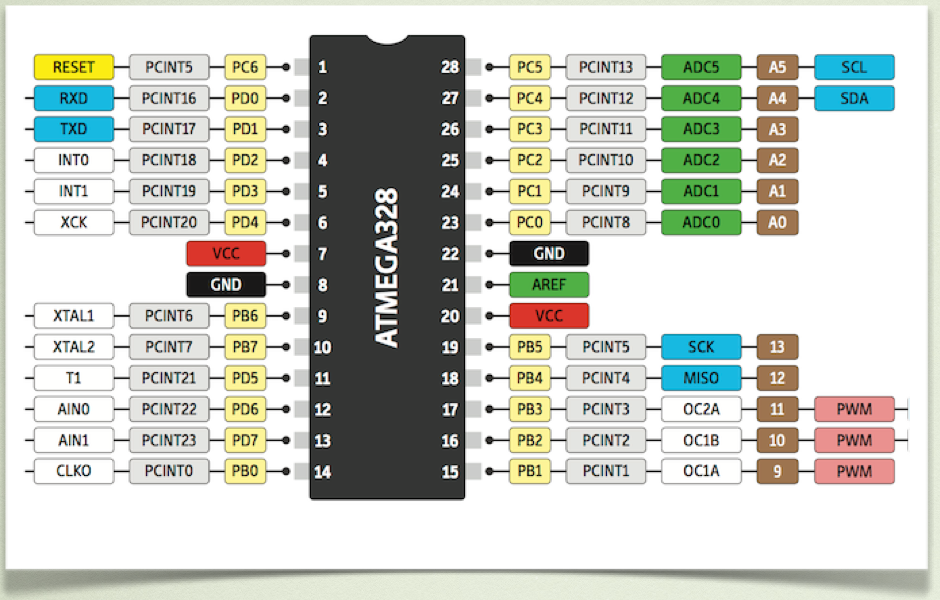

# Montajes básicos con Arduino

Antes de empezar a realizar pequeños proyectos, vamos a dar un repaso a la plataforma Arduino, con las prácticas básicas que necesitarás para comprender los conceptos y avanzar en el libro .

