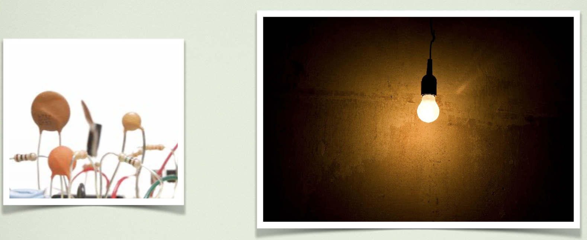

# Electrónica analógica

La electrónica es la ciencia que estudia y diseña dispositivos relacionados con el comportamiento de los electrones en la materia. En nuestro caso estudiaremos los componentes básicos utilizados en estos circuitos de bajo voltaje y usaremos Arduino, y la placa EduBásica, para practicar y entender mejor su funcionamiento.

