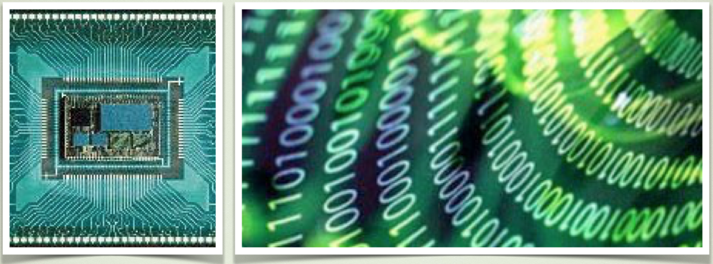

# Electrónica digital

Entendemos por electrónica digital, la que se encarga de sistemas electrónicos en los que sólo existen 2 valores o estados: verdadero/falso, "0" ó "1". 

En este capítulo trabajaremos los conceptos principales del Álgebra de Boole y de las puertas lógicas que utilizaremos para diseñar circuitos. Utilizaremos Arduino y la placa EduBásica.

# Conocimiento previo

- Programación básica de Arduino.

# Objetivos

- Conocer las propiedades del Álgebra de Boole.
- Operar con variables binarias.

Lista de materiales:

- Placa Arduino.

