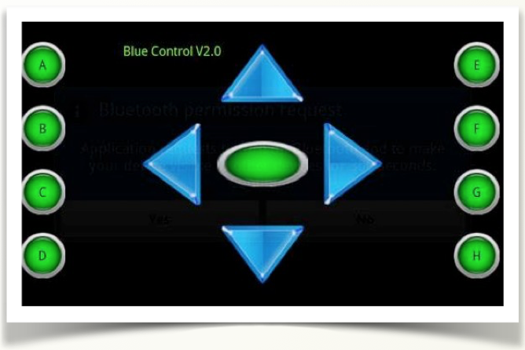

# La APP

Interactuar con el medio es uno de los objetivos primordiales de Arduino. En esta unidad vamos a ver cómo nos podemos comunicar con un dispositivo móvil, posibilitando así el control remoto de la placa. 

La comunicación con Arduino es muy sencilla, el uso común de este dispositivo, será como receptor o emisor de datos. 

En nuestro caso usaremos caracteres (bytes)  que enviaremos desde un master, como un teléfono móvil. Hay muchas aplicaciones gratuitas para enviar datos, por ejemplo, para dispositivos Android podemos utilizar de manera gratuita:

- BlueControl
- BlueTerm

Podemos hacer que un robot o vehículo se mueva dependiendo de las órdenes (letras) que reciba desde la aplicación del teléfono.

Por ejemplo, la aplicación bluecontrol muestra unos iconos a modo de joystick, en este caso al pulsar sobre cada tecla, se envía una letra:

- Arriba: U
- Abajo: D
- Izquierda: L
- Derecha: R
- Centro: C

El código de Arduino se basa en escuchar de forma continua el puerto serie. Cuando llegue un dato se ejecutará la acción que le indiquemos. 

