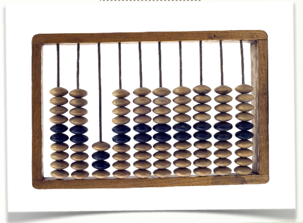

# Álgebra de Boole

- **Magnitudes analógicas:** Tienen un número infinito de valores, por ejemplo, todas las magnitudes físicas como temperatura, velocidad, electricidad, tiempo, etc …
- **Magnitudes digitales:** Consideraremos señales digitales binarias que son las que sólo toman dos valores discretos: el uno o el cero. Representarán estados “activados” o “desactivados” Por ejemplo una bombilla puede estar encendida  o apagada.

Para poder trabajar con datos binarios, el matemático inglés George Boole (1815-1864) creó una estructura algebraica que consta únicamente de 2 elementos (bits). Una álgebra que seguro conoces y utilizas a diario es el álgebra elemental, basado en la aritmética decimal que consta de 10 elementos (números), operaciones (suma, resta, ....) y propiedades (conmutativa...). Toda álgebra consta de esos 3 apartados: elementos, operaciones y propiedades. El álgebra de boole comprende:

- Elementos: 0 y 1. 
- Operaciones: multiplicación, suma, negación.
- Propiedades: conmutativa, asociativa, distributiva, elemento negado.

A los elementos de un circuito eléctrico se pueden asociar estados de “1” ó “0” si están encendidos o apagados y cerrados (conectados) o abiertos (desconectados) respectivamente.

