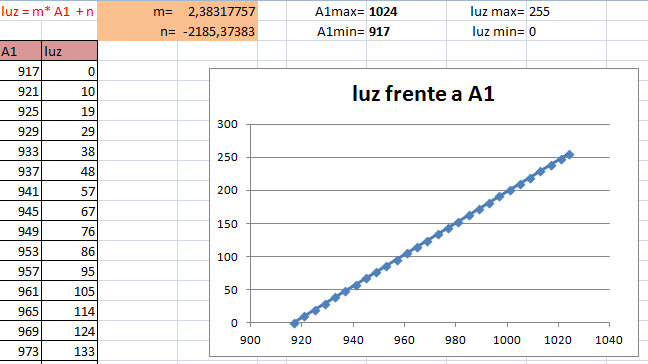

# Mapeo de valores

En ocasiones, los valores que obtenemos de una lectura de un pin, como un sensor, pueden estar fuera de una escala determinada, y tenemos que convertirlos a otro rango para poder usarlos.

El valor de salida que podemos darle al led es de 0 a 255, que se traduce en su nivel de luminosidad, pero los datos que leemos del sensor pueden llegar a 1024. Por esto debemos ***mapear*** el resultado, es decir , dejarlo en unos valores de entre 0 y  255.

La función “**map**” del programa asigna un valor máximo y un valor mínimo a un rango dado.

En el próximo montaje el valor máximo suele estar en 1024, pero el mínimo dependerá de las condiciones de luz en las que realicemos la práctica. Por eso en el código se especifican 2 variables que deberemos colocar a mano:

***bajo_LDR*** y ***alto_LDR***.

Por ejemplo si hacemos una lectura previa de lo que nos devuelve el LDR y los valores mínimo y máximo son: *917, 1024* . La solución será mapear esos valores para que, en caso de obtener el valor 917 (el equivalente a cierta intensidad luminosa), el led verde se apague.  

*Observa si tu montaje necesita de algún ajuste utilizando la función map.*

*[Aquí tienes un Excel](calculo_map.xlsx) (xlsx - 12,88 <abbr title="KiloBytes" lang="en">KB</abbr>) para ver la transformación lineal que hace map con los valores que hemos comentado*

