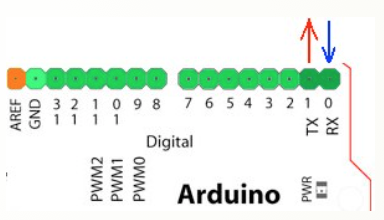
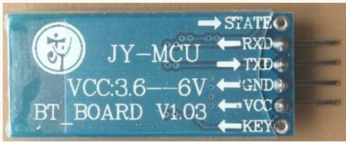
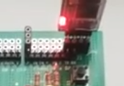
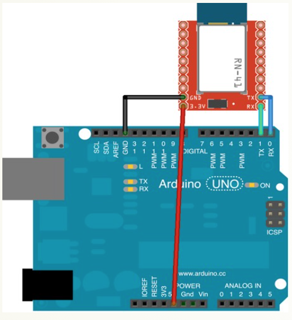

# Módulo Bluetooth

Vamos a utilizar en estos ejemplos un módulo **esclavo** de bluetooth JY-MCU muy común y económico. Es posible usar otros módulos ya que existe un mercado de desarrollo continuo, en cualquier caso el funcionamiento básico es el mismo. Dicho módulo por tratarse de un módulo **esclavo**, está configurado para conectarse a un maestro y recibir órdenes de él.  

Inicialmente no necesitas configurarlo, sino que al cargar el código desde el ordenador, conectarás el módulo y este empezará a parpadear indicando que está buscando un master al que conectarse, (por ejemplo tu teléfono o una llave bluetooth usb conectado a un pc).

Como ya sabrás los dispositivos de este tipo tienen que “emparejarse” y tienen que compartir una contraseña para que los datos puedan intercambiarse. Por defecto, estos módulos tienen la contraseña 1234, aunque tanto esto como el nombre, pueden ser actualizados mediante unos comandos especiales, llamados AT y que veremos un poco más adelante.

Arduino tiene 2 pines que permiten enviar y transmitir datos serie (uno datos tras otro). Lo usamos continuamente cuando enviamos un programa desde nuestro ordenador a Arduino o cuando hacemos una lectura desde el monitor serie (con un <strong style="font-size: 0.82em; line-height: 1.5;">Serial.print();**).

Arduino tiene definidos estos pines como:

- pin digital 0: RX &lt;-  (Arduino recibe a través de este pin).
- pin digital 1: TX -&gt; (Arduino envía a través de este pin).

El módulo bluetooth tiene 4 patillas. 2 para la alimentación y 2 para la comunicación.

Es MUY IMPORTANTE conectar de manera correcta estos pines con Arduino para la correcta comunicación. La patilla que emite los datos (TX) en el bluetooth debe estar conectada a la que recibe los datos (RX) en Arduino, y viceversa. Aunque el módulo funciona a 3.3v, normalmente las placas comerciales, (como la que estamos usando), llevan un regulador y las podemos conectar directamente a los 5v de Arduino. 

### Conexión en Edubásica

La conexión es muy fácil, ya tiene JP6 para conectarlo diréctamente, con la luz led mirando hacia dentro de la placa:

### Conexión sin Edubásica

Es también simple, utilizando una placa Protoboard.

### Ordenes

Si la luz está intermitente, el módulo no está vinculado, si está encendido permanente, ya está vinculado.

Una vez vinculado, la orden es sencilla:

_dato = Serial.read();_

donde dato es tipo byte : _byte dato;_

Ten en cuenta que estamos usando los 2 mismos pines que Arduino usa para la comunicación USB con el ordenador (0, 1), así que **no puedes usar el monitor serie** para visualizar los datos utilizando el Bluetooth. Igualmente la velocidad tiene que ser igual para entenderse, no pueden ser diferentes.

