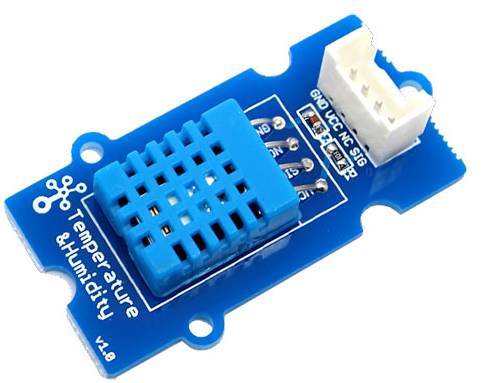

# Medida de la temperatura y la humedad ambiente.

**Realizar un montaje que mida temperatura y humedad mediante el sensor DHT11.**

Para ello tendrás que realizar las conexiones necesarias para poder obtener los datos desde Arduino. Se trata de un sensor digital que utiliza 3 pines: Alimentación +5V, tierra/GND (-) y pin de datos (out) por donde se envían los datos de humedad y temperatura. A veces el sensor viene sobre 4 pines, en este caso uno de ellos no se conecta. Como las medidas de humedad y temperatura van por un solo pin, la información se transmite como un tren de pulsos en serie, por lo tanto, necesitamos un programa que "extraiga" eso dos datos de forma diferenciada. Para ello vamos a usar una librería referenciada por **DHT11.h** que se explica en[ la siguiente página.](libreria_dht11h.html) A través del monitor serie del IDE de Arduino podremos ver las medidas obtenidas.

### ESQUEMA DHT11 :

Es un modelo "conectar y listo" que ya vienen con los cables preparados, pero si te fijas son en este orden : GND - 5V -NC - D2 donde NC significa NO CONECTADO y D2 son los datos

Lo conectamos en el Arduino sin necesidad de placa Protoboard:

utilizando cables macho

## Esquema DHT12

Es un sensor que necesita 3.3V pero si trabajas con 5V necesitas hacer este puente con una resistencia de más o menos 10K

O con la placa Protoboard

