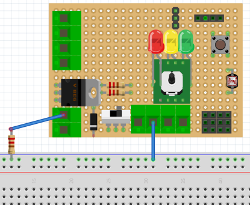

# Montaje 10: saturación y corte

Podemos jugar con el transistor en los estados saturación y corte, para ello vamos a crear una variable n que es un contador (en estado inicial n=1 y en los sucesivos se incrementa una unidad n++), si el contador es par ( el resto de n/2 = 0 o sea n%2==0) la intensidad de la corriente base sea 0 y en caso contrario que sea máxima. Pondremos un retardo de 3 segundos para visualizar bien los valores que medimos.

El programa sería:

```cpp
int ledPin = 6;
int potenPin = A0;
int intensity, valor_poten;
int n;

void setup() {
pinMode(ledPin, OUTPUT);
Serial.begin(9600);
n=1;
}

void loop() {
    if (n%2==0) intensity = 0;
    else intensity = 255;
    analogWrite(ledPin,intensity); //Envia una onda PWM especificado en la varible: intensity.
    Serial.print("n=");
    Serial.print(String(n));
    Serial.print("\tintensity = ");
    Serial.print(String(intensity));
    Serial.print("\n");
    n++;

    delay (3000);
}
```
El programa es un poco "tremendo" ¿hay alguna manera de simplificarlo?

Pondremos una resistencia de colector de 1k para forzar una corriente de saturación, pero como desde el conector X2-2 hasta V+ hay mucha distancia para conectar los dos extremos de la resistencia, utilizaremos la placa Protoboard:



Mediremos entre colector y masa, y vemos que alternativamente pasa de los estado corte (casi 5V) a saturación (casi 0V) :

https//www.youtube.com/watch?v=8ACK1oGoq-s?rel=0
Si medimos la tensión en la base, vemos que pasa de 0V a 1.28V :

https//www.youtube.com/watch?v=RlY4Lovo_po?rel=0


