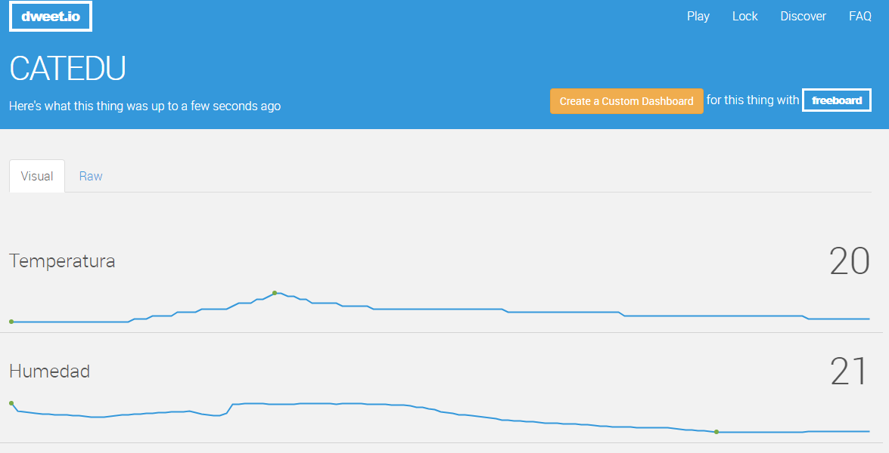

# Montaje 11 Visualización de datos en la nube. Internet de las cosas.


**Monitorizar los datos de temperatura y humedad obtenidos del sensor DHT11 en la nube.**

Para ello disponemos del portal web **dweet.io** que nos ofrece un servicio para enviar y representar datos en la nube sin necesidad, ni si quiera, de registrarnos en la plataforma.

Vamos a ver los pasos a seguir:

1. Probamos la plataforma introduciendo un dato, para ello en el navegador tecleamos por ejemplo (cambia **CATEDU **por tu nombre): [https://dweet.io/dweet/for/CATEDU?temperatura=20](http://dweet.io/dweet/for/jorgeroden?temperatura=20)[](http://dweet.io/dweet/for/jorgeroden?temperatura=20)
1. Abre otra pestaña del navegador o utiliza un móvil para seguir el dato: [https://dweet.io/follow/CATEDU](http://dweet.io/follow/jorgeroden)[](http://dweet.io/follow/jorgeroden)
1. Prueba añadiendo otra variable, en este caso la humedad: [https://dweet.io/dweet/for/CATEDU?temperatura=20&amp;humedad=8](http://dweet.io/dweet/for/jorgeroden?temperatura=20&amp;humedad=8)[](http://dweet.io/dweet/for/jorgeroden?temperatura=20&amp;humedad=80)

Automatizamos el proceso de recogida de datos desde Arduino con un programa en Processing, que enviará datos a través del navegador a dweet.io.

**IMPORTANTE**: No hay que tener abierto el monitor serie del IDE de Arduino porque ocupa el puerto y, por lo tanto, no deja leer los datos a Processing.

### PROGRAMA A CARGAR EN ARDUINO:

Si fuera un DHT12 en vez de un DHT11 poner comentarios a las 4 primeras líneas delante // y quitárselas a las 3 siguientes

```cpp
/// ////////////// CON DHT11 ////////////////////////
#include "DHT.h"
#define DHTPIN 2 
#define DHTTYPE DHT11 // DHT 11 
DHT dht(DHTPIN, DHTTYPE);
////////////////////////////////// SI FUERA DHT12 ///
//#include "cactus_io_DHT22.h"
//#define DHT22_PIN 2 
//DHT22 dht(DHT22_PIN);
/////////////////////////////////////////////

void setup() {
  Serial.begin(9600); 
  dht.begin();
}
void loop() {

  delay(2000);
  float h = dht.readHumidity();
  float t = dht.readTemperature();
  if (isnan(h) || isnan(t)) {
    Serial.println("Fallo al leer el sensor DHT11");
    return;
  }
// Únicamente enviar a Processing las variables t y h 
  Serial.print("Temperatura=");
  Serial.print(t);
  Serial.print("&Humedad=");
  Serial.println(h);
}
```

## PROGRAMA A EJECUTAR EN PROCESSING :

```cpp
// El puerto serie
Serial myPort;

void setup() {
 // Lista todos los puertos serie
 printArray(Serial.list());
 // OJO: Elige el puerto donde tengas conectado Arduino.
 // Cambia el "0" de Serial.list()[0] por el orden que 
 // tu puerto ocupe en la lista (0, 1, 2,...).
 // Si no lo tienes claro qué puerto ocupa Arduino mira
 // en el IDE Arduino en "Herramientas" mira el puerto que esté seleccionado.
 //Fíjate que tenemos la velocidad del puerto a la misma que pusimos en Arduino
 myPort = new Serial(this, Serial.list()[0], 9600);
}
void draw() {
 while (myPort.available() > 0) {
 
    String lectura = myPort.readStringUntil(lf);
    if (lectura != null) {
        println(lectura);
       //IMPORTANTE! cambia CATEDU por tu nombre 
       // visualiza los resultados en esta web https://dweet.io/follow/CATEDU
 
      loadStrings("https://dweet.io/dweet/for/CATEDU?"+lectura);
 
    }
 
  }
}
```

### REPRESENTACIÓN DE DATOS EN EL NAVEGADOR:

[https://dweet.io/follow/CATEDU](https://dweet.io/follow/CATEDU) nos **ofrecería** los datos de la siguiente manera:



>No lo hagas, pues NO LO TENGO CONECTADO !! no sale nada !! por eso pone *"nos ofrecería"*

El resultado es espectacular

<iframe src="https://giphy.com/embed/sjDV6YTbw8tig" width="480" height="363" frameBorder="0" class="giphy-embed" allowFullScreen></iframe><p><a href="https://giphy.com/gifs/reactiongifs-amazing-oc-sjDV6YTbw8tig">via GIPHY</a></p>

