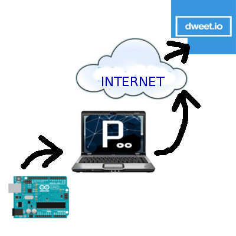

# Montaje 10 Visualización de datos en la nube. Internet de las cosas.

**Monitorizar los datos de temperatura y humedad obtenidos del sensor DHT11 en la nube.**

Para ello disponemos del portal web **dweet.io** que nos ofrece un servicio para enviar y representar datos en la nube sin necesidad, ni si quiera, de registrarnos en la plataforma.

Vamos a ver los pasos a seguir:

1. Probamos la plataforma introduciendo un dato, para ello en el navegador tecleamos por ejemplo (cambia **CATEDU **por tu nombre): [https://dweet.io/dweet/for/CATEDU?temperatura=20](http://dweet.io/dweet/for/jorgeroden?temperatura=20)
1. Abre otra pestaña del navegador o utiliza un móvil para seguir el dato: [https://dweet.io/follow/CATEDU](http://dweet.io/follow/jorgeroden)
1. Prueba añadiendo otra variable, en este caso la humedad: [https://dweet.io/dweet/for/CATEDU?temperatura=20&amp;humedad=8](http://dweet.io/dweet/for/jorgeroden?temperatura=20&amp;humedad=8)

Automatizamos el proceso de recogida de datos desde Arduino con un programa en Processing, que enviará datos a través del navegador a dweet.io.

**IMPORTANTE**: No hay que tener abierto el monitor serie del IDE de Arduino porque ocupa el puerto y, por lo tanto, no deja leer los datos a Processing.

## PROGRAMA A CARGAR EN ARDUINO:

Si fuera un DHT12 en vez de un DHT11 poner comentarios a las 4 primeras líneas delante // y quitárselas a las 3 siguientes

## PROGRAMA A EJECUTAR EN PROCESSING :

### REPRESENTACIÓN DE DATOS EN EL NAVEGADOR:

[https://dweet.io/follow/CATEDU](https://dweet.io/follow/CATEDU) nos ofrecerá los datos de la siguiente manera:

Si queremos algo más vistoso podemos utilizar el servicio [freeboard.io](freeboard.io) aunque en este caso nos tendremos que registrar en la web.

Una vez registrados podemos crear paneles indicadores configurados a nuestro gusto para visualizar la información. Primero habrá que añadir como fuente de datos Dweet.io y nuestro nombre utilizado allí (jorgeroden en el ejemplo).

Después creamos un panel indicando que la fuente de datos que queremos utilizar y la variable en cuestión a visualizar. 

¡Y  resultado puede ser de este tipo!

