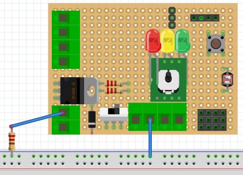
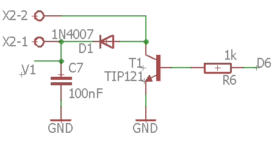

# Montaje 11: zona activa

En esta práctica el transistor va a actuar como amplificador de corriente, dentro de la zona activa para ello se va a realizar el siguiente montaje:


El funcionamiento de este circuito es el siguiente: a partir de potenciómetro que tenemos en la placa EduBásica controlamos la salida PWM del pin D6 variando la tensión aplicada a la resistencia de base Rb que en Edubásica es R6:



Utilizaremos el siguiente código:

```cpp
int ledPin = 6;
int potenPin = A0;
int intensity, valor_poten;
int n;

void setup() {
pinMode(ledPin, OUTPUT);
Serial.begin(9600);
n=1;
}

void loop() {
    valor_poten=analogRead(potenPin);
    intensity = map(valor_poten, 0, 1024, 0, 255);
    analogWrite(ledPin,intensity); 
    Serial.print("valor analógico leído=");
    Serial.println(analogRead(valor_poten));
    delay (1000);
}
```

Y el resultado es que podemos tener el transistor dentro de la zona activa manejando el potenciómetro, en el siguiente vídeo se muestra el polímetro que mide la tensión del colector y como varía de **corte** (casi 5V) a **saturación** (casi 0V) pasando por la zona **activa**: 

https//www.youtube.com/watch?v=c1kftQtfyfg?rel=0
