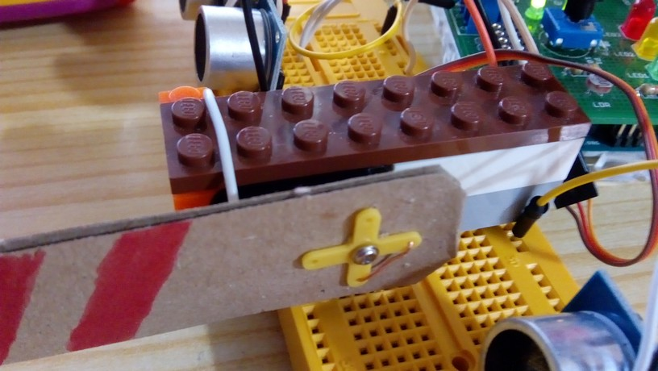

# Montaje 13 Barrera I por Bluetooth

El propósito es que cuando se pulse la flecha arriba de la [APP DEL MOVIL](/la_app.md) la barrera suba y se enciende la luz verde, y cuando se pulsa la flecha abajo, baje la barrera y se enciende la luz roja, esta es una manera eficaz de que nadie entre en el recinto si no está autorizado, y que mejor que con una aplicación móvil.

## SIN EDUBÁSICA

Hay que utilizar el esquema del servo 


y el esquema del Bluetooth **a la vez**


## CON EDUBÁSICA

Nos simplifica el cableado, conectando el módulo Bluetooth en el zócalo correspondiente [tal y como vimos](mdulo_bluetooth.html)


Con piezas de lego fijamos el servo y le añadimos un cartón que simule una barrera. El pin del servo lo conectaremos **en el 7 de Edubásica**, el Vcc y G a Vin y masa.


##Continuamos ...
  
 La configuración de los ángulos de abierto y cerrado depende en qué posición atornillamos la barrera, luego lo mejor es [probarlo con el programa que test que vimos](montaje_1_testea_tu_servo.html), y en nuestro caso nos sale que 40º es abierto y 140º es cerrado.



##Resultado

**(no hagas caso de los sensores de ultrasonidos por ahora, corresponde al siguiente montaje)**

>No desmontes las conexiones, te servirán para [el siguiente montaje.](/montaje_13_barrera_ii_con_sensores_us.md)

https//www.youtube.com/watch?v=tg0k7ZHvmCg?rel=0

El programa en el Arduino es el siguiente:

```cpp
String readString;
#include <Servo.h> 
#include <Servo.h> 
 
Servo myservo;        // crea un objeto tipo servo para controlar el servo 
int pos ;          // variable para almacenar la posición del servo
byte dato; 
int ledArriba = 3; //LED ROJO DE EDUBASICA
int ledCentro = 4; //LED AMARILLO DE EDUBASICA
int ledAbajo = 5; // LED VERDE DE EDUBASICA

void setup(){ 
  myservo.attach(7);  // En EduBasica el servo se conecta al pin 7 
  Serial.begin(9600);
  pinMode(ledArriba,OUTPUT);
  pinMode(ledAbajo,OUTPUT);
  pinMode(ledCentro,OUTPUT);
}

void loop() 
{ 
  if (Serial.available()) //Guardamos en la variable dato el valor leido
        dato= Serial.read();
   //Comprobamos el dato
   switch(dato) {//Si recibimos una  ...  85=ARRIBA  68=U=ABAJO
         case 85: //ARRIBA
           digitalWrite(ledArriba, HIGH);
           digitalWrite(ledAbajo, LOW);
           digitalWrite(ledCentro, LOW);
           pos=40;        
           myservo.write(pos); 
           delay(1000); 
           break;
         case 68: //"U": ABAJO
            digitalWrite(ledArriba, LOW);
            digitalWrite(ledAbajo, HIGH);
            digitalWrite(ledCentro, LOW);
            pos=140;       
            myservo.write(pos); 
            delay(1000);
           break;
    }       
  
}
```

