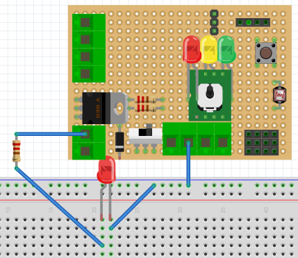
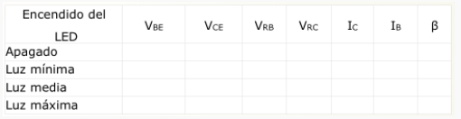
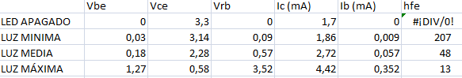

# Montaje 12: Con un diodo se ve bien

Podemos insertar un diodo y se visualiza bien las zonas:

El programa es el mismo que el anterior y se puede ver en el vídeo las tras formas de funcionamiento del transistor. Se trata de ir variando el valor del potenciómetro R1, con el fin de conseguir que el diodo led pase de estar apagado (corte), a encendido en diferentes grados de luminosidad, llegando finalmente hasta su máxima luminosidad (saturación).

La mayor o menor intensidad del diodo led nos indicará la mayor o menor corriente que fluye por el colector (IC) al variar la corriente de base (IB).

https//www.youtube.com/watch?v=oLuCdvOg0co?rel=0

Mediante un polímetro se pueden medir los valores de tensión. Para medir estas corrientes recurriremos, como en otras ocasiones, al polímetro en forma de voltímetro y aplicar la ley de Ohm.

A nosotros nos ha salido [resultados](calculo_hfe.xlsx) (xlsx - 15,87 <abbr title="KiloBytes" lang="en">KB</abbr>)

