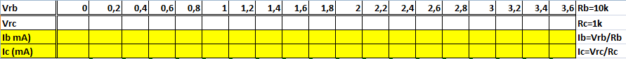
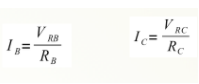
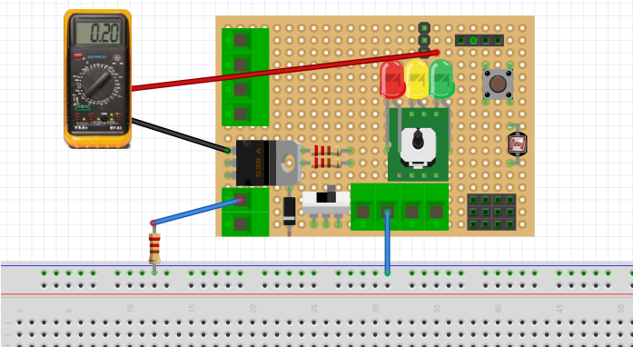
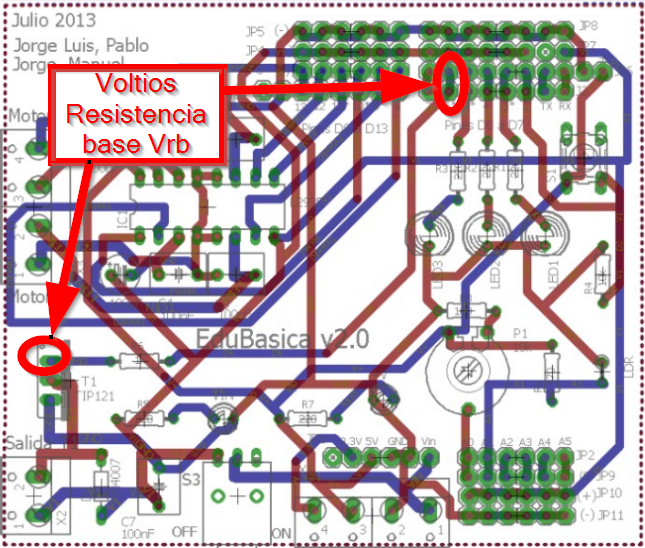
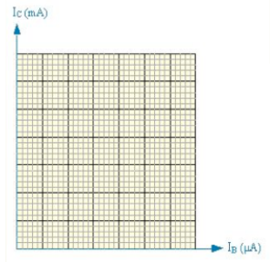
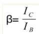

# Montaje 13: cálculo de hfe

Con [el mismo circuito anterior](montaje_11_zona_activa.html), se mide la tensión en los terminales de Rb (que está en la placa) y Rc (la que hay que montar en un protoboard) completando la siguiente tabla:

Se varía el potenciómetro, progresivamente para conseguir las tensiones en la resistencia de base que figuran en la tabla Una vez obtenidos todos los valores, calcular la Intensidad de colector y la intensidad de la base con estas fórmulas

que en el caso de Edubásica Rb es R6 y son 10k

Creemos que la mejor forma de leer Vrb es desde los extremos de la base del transistor y D6:

Podemos llevarlos a una gráfica y trazar la curva característica Ic= f(Ib)

La ganancia de corriente β se calcula: 

Según la [DataSheet](https://alltransistors.com/pdfview.php?doc=tip121.pdf&amp;dire=_fairchild_semi) de este transistor te tiene que salir alrededor de 1.000, nosotros hemos realizado la práctica y nos sale 13 ¡no lo entendemos!   :(

[[resultados](http://aularagon.catedu.es/materialesaularagon2013/Arduino-codigo/3_Electronica_analogica/calculo_hfe.xlsx) (xlsx - 15,87 <abbr title="KiloBytes" lang="en">KB</abbr>)]

