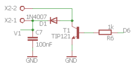

# Montaje 14: Pitido
Vamos a incorporar un altavoz y realizar una sirena. Al ser una bobina, es conveniente utilizar una amplificación por medio de un transistor, por D6 enviaremos la señal cuadrada a la base del transistor.

##SIN EDUBASICA


## Con EDUBÁSICA

Conectaremos el altavoz en el tereminal X2 y el interruptor V1 en ON para que esté alimentado



##Continuamos ...

El código es muy sencillo, simplemente es una intermitencia por** D6** que en este caso se ha elegido **1mseg** ¿que pasaría si aumentamos este valor?

```cpp+lineNumbers:true
void setup() {
  // put your setup code here, to run once:
  pinMode(6, OUTPUT); 
}

void loop() {
  // put your main code here, to run repeatedly:
   digitalWrite(6, HIGH);   // Encendemos el pin6
   delay(1);              // esperamos 1 msegundo
   digitalWrite(6, LOW);    // Apagamos el pin6  
   delay(1);        // esperamos 1 msegundo
}
```

El resultado es :

https//www.youtube.com/watch?v=7SsKMj2WMSw?rel=0

## SIN EDUBÁSICA Y SIN TRANSISTOR A LO BRUTO !

Bueno, vamos a conectarlo DIRECTAMENTE a D6 (el otro extremo a GND) no es muy conveniente pero a ver el resultado (con el mismo código):

https//www.youtube.com/watch?v=wcJBEfr8hNo?rel=0

¿Cuál suena más?

> Premio entrada a dinópolis Teruel quien acierte..

<iframe src="https://giphy.com/embed/3o6gb18J2gERJiLmmc" width="480" height="352" frameBorder="0" class="giphy-embed" allowFullScreen></iframe><p><a href="https://giphy.com/gifs/oscars-academy-awards-3o6gb18J2gERJiLmmc">via GIPHY</a></p>


