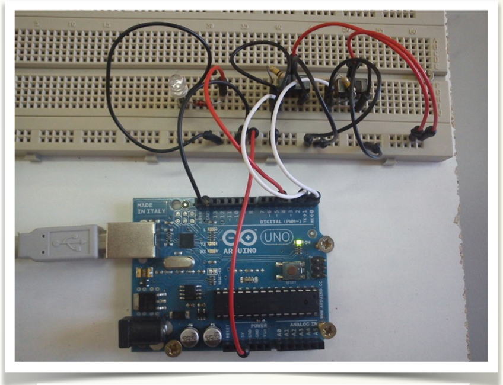
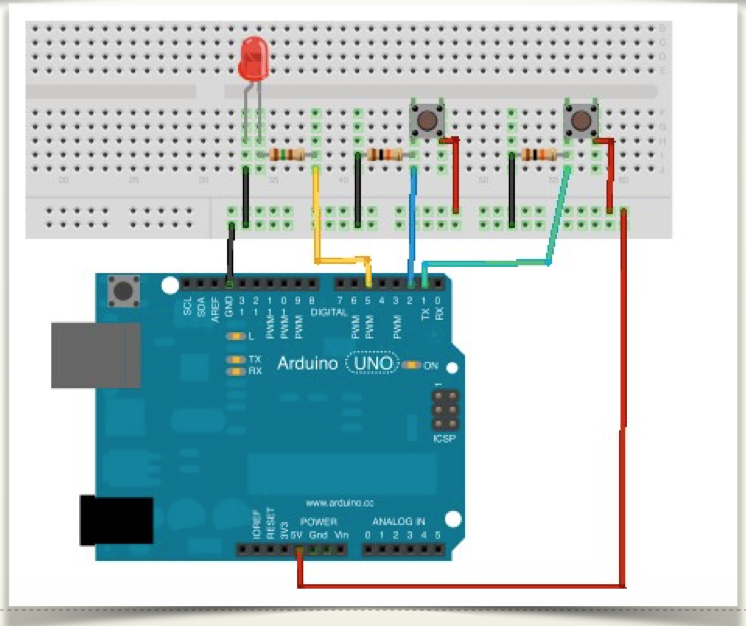

# Montaje 1 AND sin EDUBASICA

## PULSADORES:

Vamos a simular dos entradas lógicas (“1” ó “0”) con dos pulsadores, (pueden ser conmutadores). En este ejemplo usaremos la función AND de manera que, según el estado de las 2 entradas, obtendremos una señal de salida (“1” ó “0”) conforme a la tabla de verdad de la operación. Si te animas puedes montar el circuito tú mismo en una protoboard siguiendo este esquema:

Las entradas están en los pines digitales 1 y 2. Y la salida del sistema es un led (en pin 5) que estará encendido/apagado según el resultado de aplicar la función AND a las 2 variables de entrada.





## **PROGRAMA:**

```cpp
/*
  Boole
  Función AND con 2 variables
 */

int var1 = 7;   //Pin de entrada del pulsador 1
int var2 = 2;   //Pin de entrada del pulsador 1
int led = 5;    //Pin de salida para el led(rojo)
int estado1 = 0;    //Para almacenar el estado de la variable1
int estado2 = 0;    //Para almacenar el estado de la variable2
int resultado = 0;  //Para almacenar el resultado      

void setup() {
  pinMode(var1, INPUT);     //Iniciliza el pin de entrada 1 como salida
  pinMode(var2, INPUT);     //Iniciliza el pin de entrada 2 como salida  
  pinMode(led, OUTPUT);     //Iniciliza el pin del led como salida 
}

void loop(){
  estado1 = digitalRead(var1);  //Lee el estado del botón y lo almacena
  estado2 = digitalRead(var2);  //Lee el estado del botón y lo almacena
  resultado = (estado1 && estado2); //Función AND con los dos estados
  digitalWrite(led, resultado);    //Escribimos el resultado en el led
}
```