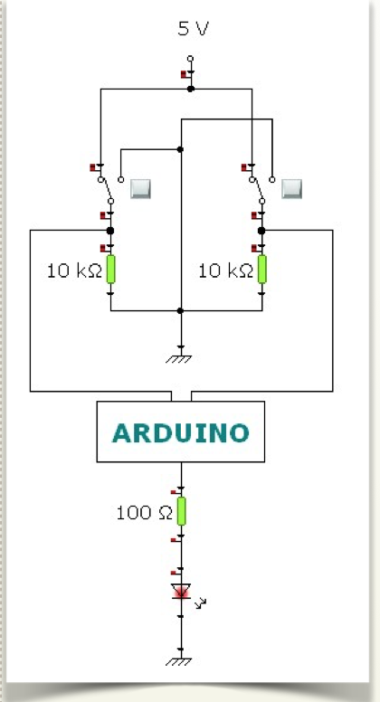

# Montaje 1 AND sin EDUBASICA

## PULSADORES:

Vamos a simular dos entradas lógicas (“1” ó “0”) con dos pulsadores, (pueden ser conmutadores). En este ejemplo usaremos la función AND de manera que, según el estado de las 2 entradas, obtendremos una señal de salida (“1” ó “0”) conforme a la tabla de verdad de la operación. Si te animas puedes montar el circuito tú mismo en una protoboard siguiendo este esquema:

Las entradas están en los pines digitales 1 y 2. Y la salida del sistema es un led (en pin 5) que estará encendido/apagado según el resultado de aplicar la función AND a las 2 variables de entrada.

## **PROGRAMA:**

