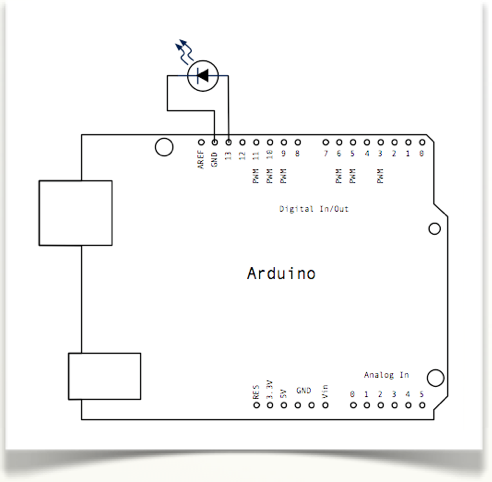

# Montaje 1: LED parpadeante sin EDUBASICA

Vamos a controlar el encendido y apagado de un led conectado al pin13 de Arduino. 

¿Por qué el pin13 y no otro? Podríamos hacerlo con otro, pero el pin13 tiene asociado un led en la placa justo debajo de el y así nos evitamos tener que montar. Si pusiéramos un pin polarizado correctamente entre el pin13 y GND también funcionaría. El pin13 tiene también una resistencia que hace posible conectarle un led directamente, si hacemos el montaje con otro pin debemos añadir esta resistencia de 10Kohm entre el led y el pin.

>Acuérdate: La pata más larga del LED es el (+) por lo tanto en el D13 y el corto (-) en GND.



```cpp+lineNumbers:true
void setup() {                
  // inicializamos el pin 13 
  // para que sea de salida
  pinMode(13, OUTPUT);     
}
// Definimos la rutina cíclica
void loop() {
  digitalWrite(13, HIGH);   // Encendemos el pin13
  delay(1000);              // esperamos 1 segundo
  digitalWrite(13, LOW);    // Apagamos el pin13  
delay(1000);                // esperamos 1 segundo
}
```

Todo lo que está entre las llaves de **loop()**, se ejecuta indefinidamente. Así vemos un efecto de led parpadeante ya que si analizamos las líneas del código vemos que el proceso es:

- Encendemos.
- Esperamos un segundo.
- Apagamos.
- Esperamos un segundo.  

¡Atrevámonos y cambiemos los tiempos de parada!

https://www.youtube.com/watch?v=EFFSLvIF9rY


