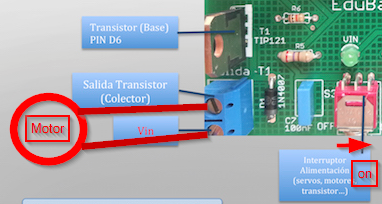

# Montaje 1bis AND con EDUBASICA

En este caso, para ahorrar cableado, vamos a utilizar:

- Como variable 1 de entrada el pin D2 que ya tiene el **pulsador**, y lo visualizaremos en el pin D4 que tiene el **LED VERDE**
- Como variable 2 de entrada el pin D5 que lo conectaremos con un cable a V1 que tiene el **interruptor** y ya se visualiza en el **LED AMARILLO**
- Como variable de salida el pin D3 que es el **LED ROJO**

El esquema sería el siguiente:

Y el esquema de conexiones es muy fácil, conectar V1 con el agujero D5 de JP6:

Aquí teneis el detalle de dónde está el agujero D5

El código sería:

Y el resultado es :

https//www.youtube.com/watch?v=CKTcNi1YwY4?rel=0
