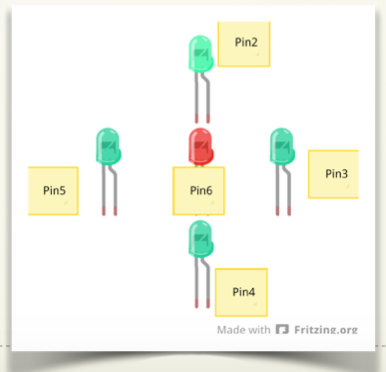
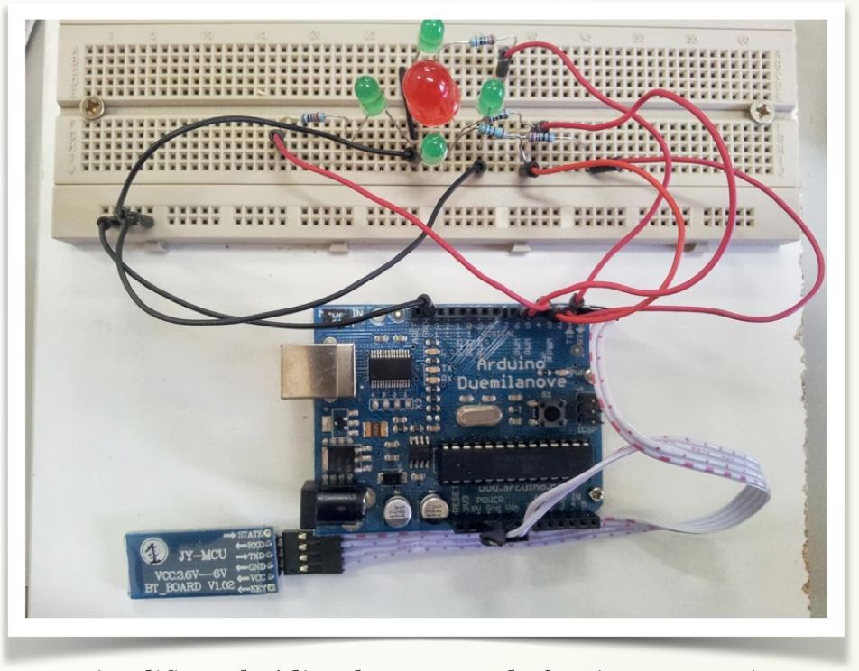

# Montaje 1bis Encender LEDs sin EDUBASICA

Este ejemplo es más avanzado, pero no se puede hacer con edubásica: Vamos a ver un ejemplo implementando un **mosaico de LEDs**:



Las conexiones serán las siguientes:



El objetivo es que según la tecla que presionemos en la aplicación “Blue Control”, se encenderá el led correspondiente: (arriba, abajo, izquierda, derecha y centro). Además si pulsamos alguno de los botones laterales, los leds deberán realizar una animación de todos los leds:

-    Encendido de los leds en sentido horario.
-    Encendido de los leds en sentido antihorario.
-    Encendido intermitente de los leds exteriores y el interior.
-    Encendido intermitente de todos los leds.

INVENTA MÁS ANIMACIONES PARA INCLUIRLAS EN LOS BOTONES QUE SOBRAN EN LA APLICACIÓN

Para simplificar el código, hemos creado funciones para ejecutar cada una de las animaciones, estas funciones están al final del programa.

La lectura se hace mediante 2 funciones:

- La función **Serial.available()** nos indica si hay un dato disponible en el puerto serie (verdadero/falso)
- Con la función **dato = Serial.read();** guardamos el dato en una variable (de typo byte)

Con esto tendremos el código ASCII del  caracter enviado por el maestro, por ejemplo si hemos enviado una A tendremos el 65, B = 66, a = 97, b = 98, ... (ascii.cl/es/)

Lo único que nos queda es comparar el dato recibido y elegir la acción que tiene que hacer Arduino.

### Programa

```cpp
//LEDS CONECTADOS EN FORMA DE ESTRELLA Y UNO EN EL CENTRO
//mEDIANTE BLUETERM ENVIAMOS CARACTERES (SEGUN LAS TECLAS) Y SE
//ENCIENDEN / APAGAN LOS LEDS SELECCIONADOS
int ledArriba = 2;
int ledCentro = 6;
int ledAbajo = 4;
int ledDerecha = 3;
int ledIzquierda = 5;
byte dato;
////////////////////////////////////////////////////////////////////////
void setup() {
Serial.begin(9600);
pinMode(ledArriba,OUTPUT);
pinMode(ledAbajo,OUTPUT);
pinMode(ledIzquierda,OUTPUT);
pinMode(ledDerecha,OUTPUT);
pinMode(ledCentro,OUTPUT);
}
void loop() {
  if (Serial.available()) //Guardamos en la variable dato el valor leido
        dato= Serial.read();
   //Comprobamos el dato
   switch(dato)
       {//Si recibimos una  ...
         case 85: //ARRIBA
         {
           digitalWrite(ledArriba, HIGH);
           digitalWrite(ledAbajo, LOW);
           digitalWrite(ledDerecha, LOW);
           digitalWrite(ledIzquierda, LOW);
           digitalWrite(ledCentro, LOW);
           
         break;
       }
         case 68: //"U": ABAJO
         {
           digitalWrite(ledArriba, LOW);
           digitalWrite(ledAbajo, HIGH);
           digitalWrite(ledDerecha, LOW);
           digitalWrite(ledIzquierda, LOW);
           digitalWrite(ledCentro, LOW);
           
           break;
         }
           case 67: //"D": CENTRO
         {
           digitalWrite(ledArriba, LOW);
           digitalWrite(ledAbajo, LOW);
           digitalWrite(ledDerecha, LOW);
           digitalWrite(ledIzquierda, LOW);
           digitalWrite(ledCentro, HIGH);
           
           break;
         }
         case 76: //"L": IZQ
         { 
           digitalWrite(ledArriba, LOW);
           digitalWrite(ledAbajo, LOW);
           digitalWrite(ledDerecha, LOW);
           digitalWrite(ledIzquierda, HIGH);
           digitalWrite(ledCentro, LOW);
           break;
         }
         case 82: //"R": DCH
         {
           digitalWrite(ledArriba, LOW);
           digitalWrite(ledAbajo, LOW);
           digitalWrite(ledDerecha, HIGH);
           digitalWrite(ledIzquierda, LOW);
           digitalWrite(ledCentro, LOW);
           break;
         }
         case 97: //Recibimos "a"
         {
            sentidoReloj();
            break;
         }
         case 98: //Recibimos "b"
         {
           sentidoContrario();
           break;           
         }
         case 99: //Recibimos "c"
         {
           fueraDentro();
           break;          
         }
}
}

void sentidoReloj(){
   digitalWrite(ledArriba, HIGH);   
  delay(100);                  
  digitalWrite(ledArriba, LOW);    
  delay(10); 
  digitalWrite(ledDerecha, HIGH);   
  delay(100);                  
  digitalWrite(ledDerecha, LOW);    
  delay(10); 
  digitalWrite(ledAbajo, HIGH);   
  delay(100);                  
  digitalWrite(ledAbajo, LOW);    
  delay(10); 
  digitalWrite(ledIzquierda, HIGH);   
  delay(100);                  
  digitalWrite(ledIzquierda, LOW);    
  delay(10); 
 }

void sentidoContrario(){
  digitalWrite(ledArriba, HIGH);   
  delay(100);                  
  digitalWrite(ledArriba, LOW);    
  delay(10); 
  digitalWrite(ledIzquierda, HIGH);   
  delay(100);                  
  digitalWrite(ledIzquierda, LOW);    
  delay(10); 
  digitalWrite(ledAbajo, HIGH);   
  delay(100);                  
  digitalWrite(ledAbajo, LOW);    
  delay(10); 
  digitalWrite(ledDerecha, HIGH);   
  delay(100);                  
  digitalWrite(ledDerecha, LOW);    
  delay(10); 
  }
void fueraDentro(){
 digitalWrite(ledArriba, HIGH);                     
  digitalWrite(ledDerecha, HIGH);    
  digitalWrite(ledAbajo, HIGH);                     
  digitalWrite(ledIzquierda, HIGH);
  delay(1000);
  digitalWrite(ledArriba, LOW);   
  digitalWrite(ledDerecha, LOW); 
  digitalWrite(ledAbajo, LOW); 
  digitalWrite(ledIzquierda, LOW);
  delay(10);
  digitalWrite(ledCentro, HIGH);   
  delay(1000);                  
  digitalWrite(ledCentro, LOW);    
  delay(10); 
}
```

