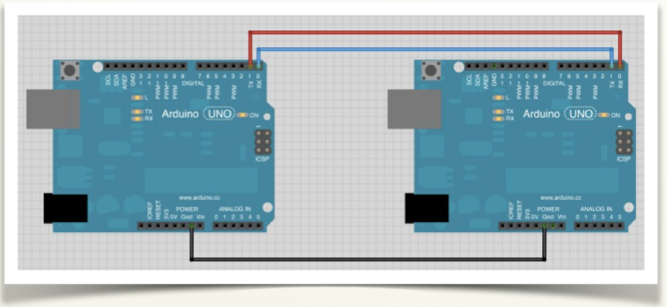

# Montaje 2: Conectar dos Arduinos

El proceso es parecido al bluetooth. Aquí queremos que una Arduino envíe (MAESTRO) y que otra reciba (ESCLAVO), así que cada una correrá un programa distinto.

Podemos hacer también que ambas tarjetas envíen y reciban datos, para ello, la modificación sobre lo que expongo aquí serían muy sencillas, (básicamente copiar y pegar los trozos de código intercambiados).

**Conexiones:**

Usaremos los pines estándar de comunicación serie de Arduino: 

- 0 : RX (pin por el que RECIBE los datos serie)
- 1 : TX (pin por el que ENVÍA los datos serie)

Para comunicación en 2 direcciones: los 2 pueden enviar / recibir. Las conexiones TX/RX se intercambian (lo que uno envía -TX- tiene que entrar en el otro -RX-). Cualquiera de las 2 puede ser Maestro o Esclavo. **IMPORTANTE**: Conectar ambas GND de las placas.

En el siguiente ejemplo , el maestro, cada 3 segundos envía un carácter al esclavo.

- Si envía una "r", el esclavo hará parpadear su led (d13) rápido.
- Si envía una "l", el esclavo hará parpadear su led (d13) lento.

El programa para el Arduino MAESTRO es:

El programa para el Arduino ESCLAVO es:

### Si no tienes dos ARDUINOS

Puedes hacerlo con una simulación en [https://www.tinkercad.com](https://www.tinkercad.com) en nuestro caso este fue el resultado:

https//www.youtube.com/watch?v=GNtVo0xP9mA?rel=0
### Si tienes dos ARDUINOS

Pues a disfrutar de tu "Red particular" :

https//www.youtube.com/watch?v=VmFl1mXa65U?rel=0

