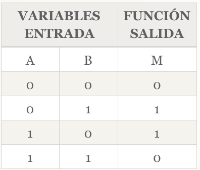
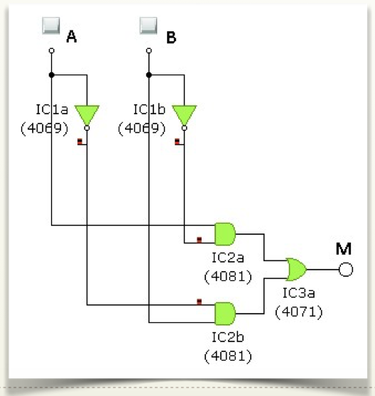

# Montaje 2 ELEVADOR sin EDUBASICA

## FUNCIONES LÓGICAS:

Tenemos un elevador neumático que se puede controlar desde 2 habitaciones contiguas del taller. Para que el elevador funcione debe estar accionado cualquiera de los 2 pulsadores existentes, pero por seguridad no funcionará si dos operarios la accionan simultáneamente.

Identificar las variables de entrada y función de salida:

*Entradas*:

- **A:** un pulsador
- **B:** un pulsador

*Salida o valor de la función:*

- **Motor que acciona el compresor del elevador**

TABLA DE VERDAD:



Función Canónica: M(FC1) = NOT(A) * B + A * NOT(B)

Puertas Lógicas:

- 2 puertas NOT
- 2 puertas AND
- 1 puerta OR

(Es decir, una [función XOR](https://es.wikipedia.org/wiki/Puerta_XOR))



## PROGRAMA:

```cpp
/*
  Implementación de Función lógica
 */

int var1 = 1;   //Pin de entrada del pulsador 1
int var2 = 2;   //Pin de entrada del pulsador 1
int led = 5;    //Pin de salida para el led(rojo)

int A = 0;    //Para almacenar el estado de la variable1
int B = 0;    //Para almacenar el estado de la variable2
int resultado = 0;  //Para almacenar el resultado      

void setup() {
  pinMode(var1, INPUT);     //Init pin de entrada 1 como salida
  pinMode(var2, INPUT);     //Init pin de entrada 2 como salida  
  pinMode(led, OUTPUT);     //Iniciliza el pin del led como salida 
}

void loop(){
  A = digitalRead(var1);  //Lee el estado 1 y lo almacena
  B = digitalRead(var2);  //Lee el estado 2 y lo almacena
  //Función Lógica ------  R=(â*b)+(a*^b)
  resultado = (!A && B) || (A && !B);
  digitalWrite(led, resultado);    //Escribimos el resultado en el led
}
```