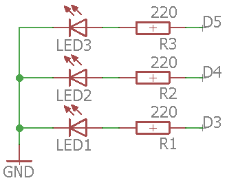

# Montaje 2: LED EDUBASICA parpadeante

Igual que en el caso anterior, pero vamos a utilizar un LED de la shield de Edubásica, tenemos tres opciones:

- LED VERDE pin 3
- LED AMARILLO pin 4
- LED ROJO pin 5

El programa es igual que el anterior, pero cambiando el número del pin:

void setup() { 
// inicializamos el pin 3 en Edubásica tiene el LED VERDE
// para que sea de salida
pinMode(3, OUTPUT); 
}
// Definimos la rutina cíclica
void loop() {
digitalWrite(3, HIGH); // Encendemos el pin 3
delay(1000); // esperamos 1 segundo
digitalWrite(3, LOW); // Apagamos el pin 3 
delay(1000); // esperamos 1 segundo
}

https//www.youtube.com/watch?v=UHttCda49Vo?rel=0
