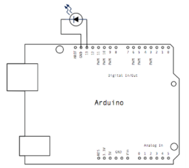

# Montaje 3 ALARMA EN VIVIENDA con EDUBASICA

Gracias a la lógica programable podemos programar alarmas muy complejas y mucho más eficientes que las alarmas convencionales. Las alarmas convencionales usan finales de carrera y, en definitiva, interruptores que activan una alarma. En nuestro caso vamos a dotar a la alarma de cierta lógica que nos proporcione mejores y más cómodos resultados. Las posibilidades son ilimitadas y depende de tu imaginación . En esta práctica y sólo como ejemplo vamos a suponer algunas cosas que, si bien no tienen por qué ajustarse a la realidad, si que sirven como ejemplo para mostrar y dar a entender las posibilidades de la alarma. puerta, encender la luz y cerrar la puerta. Partimos de las siguientes premisas :

1. El ladrón puede entrar sólo por la ventana o por la puerta. Fíjate en las puertas y ventanas de los comercios de tu localidad. Seguro que has visto más de uno.
1. Como la ventana de la casa da a una calle principal muy transitada el ladrón no intentará entrar nunca por la ventana cuando sea de día.
1. La entrada de nuestra casa es oscura y no tiene ventanas al exterior, por lo tanto nuestro comportamiento habitual es abrir la puerta, encender la luz y cerrar la puerta.
1. Sólo abrimos las ventanas de día, nunca por la noche.

Con EDUBASICA:

- Como detector de** apertura de puerta** vamos a usar el pulsador de la PLACA EDUBASICA (**D2**)
- Como detector de la **ventana** vamos a usar un pulsador que montaremos sobre la protoboard que lo conectaremos a la clema **D7**. 
- Sabremos si es de **día** o de **noche** gracias al **LDR** de la EduBásica.
- Uitlizaremos el interruptor V1 como **RESET** por lo tanto lo conectaremos a A2 para leerlo

El esquema sería el siguiente

Ten en cuenta que los interruptores podrían sustituirse en un caso real con relé un Reed conocido también como interruptor magnético. Son elementos económicos y de muy fácil instalación. Vamos a realizar la práctica en dos pasos para que lo puedas entender sin problemas. 

Este sería el programa:

Abre el “monitor serial” y prueba a activar los pulsadores. Verás que cuando están activos el valor obtenido es 1 y cuando están desactivados su valor es 0. Comprueba qué interruptor se corresponde con la ventana y cual con la puerta. Tapa ahora el LDR y observa el valor que obtienes cuando no recibe luz (será el mismo valor que si es de noche). A nosotros nos ha salido:

Atendiendo a los supuestos anteriores carga este programa y observa su funcionamiento. Si el led rojo se enciende es que la alarma se ha disparado.

El resultado es :

https//www.youtube.com/watch?v=Tx2Z-GtNR2k?rel=0
# Actividad

Como comprobarás una vez que la alarma se activa permanece en ese estado. Para desactivarla debes de activar el interruptor.

Piensa en otra solución para poder desactivar la alarma, por ejemplo abriendo la ventana y la puerta a la vez.

# Actividad

**Ampliación:**

Usamos EduBásica porque dispone de elementos hardware ya instalados, como led y pulsador, pero piensa que sin EduBásica tu Arduino dispone de 13 entradas digitales y 6 analógicas. Piensa en un sistema más completo de alarma en el que puedas conectar sensores de humo o de movimiento (PIR).

# Actividad

**Proyecto propuesto:**

Realiza todo el proceso para implementar, mediante funciones lógicas, el siguiente sistema:

Se trata de una máquina de control de una cinta transportadora. Tenemos un sensor de temperatura basado en un termistor que nos dirá si se ha producido un sobrecalentamiento en la máquina. También hay un sensor de presión que detecta la presencia de un objeto sobre la cinta transportadora. Por último, la cinta transportadora sólo estará en funcionamiento si el operario mantiene apretado un pulsador. Tendremos un led que avisará si hay sobrecalientamiento y detendrá la cinta si está en movimiento. Un zumbador avisará cuando la cinta esté en movimiento.

