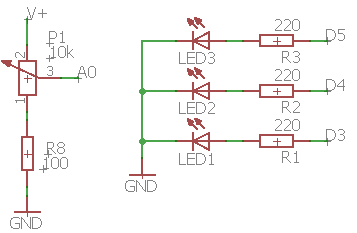

# Montaje 3: Potenciómetro EDUBASICA

Para este montaje utilizamos la tarjeta Edubásica. Lo primero que haremos será cargar un programa para comprobar que al variar el valor de una resistencia mediante un potenciómetro, también variará la cantidad de luz que emite un led. Como se puede ver en el siguiente vídeo, a medida que giramos el potenciómetro el led varía su luminosidad.



https://www.youtube.com/watch?v=EAryWgTyt8Y&feature=youtu.be

```cpp
//Declaramos una variable para almacenar el valor recibido en pin 0.
int val = 0;

void setup() {
//El pin 3 corresponde al LED verde
pinMode(3, OUTPUT);
}

void loop() {
/*leemos el valor del pin O modificado por el potenciómetro que va desde 0 a 1023*/
val = analogRead(0);
/*Escribimos el valor obtenido en el LED verde que puede ser entre 0 y 255. Por eso dividimos val por 4 */
analogWrite(3, val/4);
}
```

