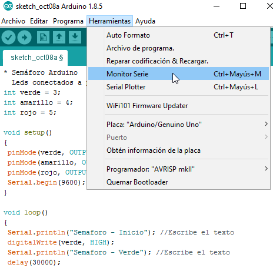

# Montaje 3: SEMAFORO CON EDUBASICA

Montaremos un semáforo con los tres leds de la EduBásica. La EduBásica es opcional y podemos montar el circuito correspondiente con una protoboard, pero EduBásica nos ahorra trabajo. 

# Montaje 3: SEMÁFORO SIN EDUBASICA

Necesitamos añadir una resistencia entre el pin y el led, para evitar que el led se funda. 


en este caso tienes libertad de utilizar D3 D4 D5 o otros que quieras.

## Continuamos ...
Como EduBásica ya lleva estas resistencias integradas las capturas las hacemos con ella, no hay que hacer nada.

Vamos a ver el efecto que queremos realizar:

https://www.youtube.com/watch?v=ntLtCwBPeB4

Carga el programa de la página siguiente en Arduino y verás como actúa.

Aparece un nuevo comando: **Serial.print**.

Este comando nos manda un texto al puesto serial por el que nos comunicamos con Arduino. De esta manera podemos depurar un programa sabiendo siempre por que línea está.

Para que funcione debemos tener en cuenta que:

- Hay que inicializar Serial. Esto se hace poniendo **Serial.begin(9600)** dentro de la rutina de setup(). 9600 se refiere a la velocidad que se comunicará.
- Serial.print(“xxx”) escribe lo que ponemos entre comillas tal cual.
- Serial.print(x) escribe el valor que contenga la variable x.
- Serial.println() es similar a lo anterior pero después añade un salto de línea.

Para ver lo que nuestro Arduino nos comunica por Serial, abrimos el monitor Serial que tenemos en el programa Arduino:




```cpp+lineNumbers:true
/* Semáforo Arduino
  Leds conectados a pines 3, 4 y 5 */
int verde = 3;
int amarillo = 4;
int rojo = 5;

void setup()
{
 pinMode(verde, OUTPUT);
 pinMode(amarillo, OUTPUT);
 pinMode(rojo, OUTPUT);
 Serial.begin(9600); //inicializa la comunicación Serial
}

void loop()
{
 Serial.println("Semaforo - Inicio"); //Escribe el texto 
 digitalWrite(verde, HIGH);
 Serial.println("Semaforo - Verde"); //Escribe el texto
 delay(30000);
 digitalWrite(verde, LOW);
 digitalWrite(amarillo, HIGH);
 Serial.println("Semaforo - Amarillo"); //Escribe texto
 delay(8000);
 digitalWrite(amarillo, LOW);
 digitalWrite(rojo, HIGH);
 Serial.println("Semaforo - Rojo"); //Escribe el texto
 delay(20000);
 digitalWrite(rojo, LOW);
}
```
