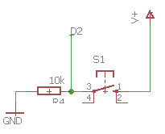
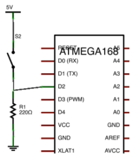

# Montaje 4: Pulsador

Hasta ahora hemos visto como programar Arduino para que ejecute repetitivamente acciones, pero este actuaba de manera autónoma y nosotros sólo podíamos observar.  Pero podemos interactuar con Arduino, por ejemplo, realizando una acción cuando activamos un pulsador. .

En este ejemplo, vamos a encender un led cuando actuamos sobre el pulsador. 

## sin EDUBASICA

Utilizamos por ejemplo el pin 2 corresponde al pulsador y el pin 3 al led verde, solo nos queda cargar el programa y probar. 






## con EDUBASICA

Con la misma estructura (D2 es donde está el pulsador en EDUBASICA y D3 el LED VERDE) no hace falta realizar ningún cableado.

Por sencillez usaremos EduBásica en las capturas. Vamos a verlo en acción:

https://www.youtube.com/watch?v=lpTU2J2xjTE

## Continuamos...

Aparece un comando nuevo “**digitalRead(buttonPin)**” . Retorna el valor del pin que se ha configurado como entrada y al igual que en el caso de los pines que se configuran como salida, puede tener dos valores HIGH y LOW.

Si es HIGH significa que este pin está unido a la señal de 5v, si es LOW significa que está unido a 0v.

 ¿Por qué cuando el pulsador está en OFF D2 está a 0V? espero que esta cuestión la has resuelto [en la sección anterior.](resistencias_pullup_y_pulldown.html)

```cpp+lineNumbers:true
const int buttonPin = 2;     // Pin del pulsador
const int ledPin =  3;      // Pin del Led

void setup() {
  // pin del led de salida:
  pinMode(ledPin, OUTPUT);      
  // pin del pulsador de entrada
  pinMode(buttonPin, INPUT);     
}

void loop(){

  // Si el valor del pin del pulsador es HIGH es que esta pulsado
  if (digitalRead(buttonPin) == HIGH) {     
    // Se enciende el LED:    
    digitalWrite(ledPin, HIGH);  
  } 
  else {
    // Se apaga el LED:
    digitalWrite(ledPin, LOW); 
  }
}
```

Otra opción es utilizar este programa donde se ve más visual:

```cpp+lineNumbers:true
// Indicamos que pin corresponde con cada LED:
int ledVerde = 5;
int ledAmarillo = 4;
int ledRojo = 3;
// El pulsador esta conectado al pin 2
int pulsa = 2;

// configuracion de pines
void setup() {                
  // los pines con leds son de salida
  pinMode(ledVerde, OUTPUT);     
  pinMode(ledAmarillo, OUTPUT);     
  pinMode(ledRojo, OUTPUT);  
  pinMode(pulsa, INPUT); //pin de entrada   
}

void loop() {
  //Leemos del pin 2 para saber si se esta pulsando el boton
 if (digitalRead(pulsa) == HIGH) //Si esta pulsado ENCENDEMOS
 {
  digitalWrite(ledVerde, HIGH);   
  digitalWrite(ledAmarillo, HIGH);   
  digitalWrite(ledRojo, HIGH);  
 }
 else
 {
  digitalWrite(ledVerde, LOW);    
  digitalWrite(ledAmarillo, LOW);   
  digitalWrite(ledRojo, LOW);  
  }
}
```