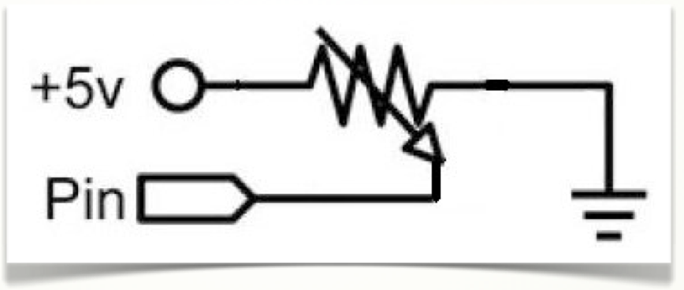
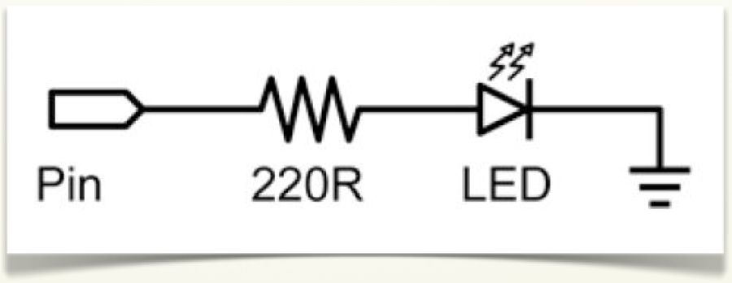
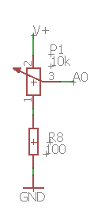
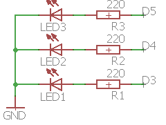
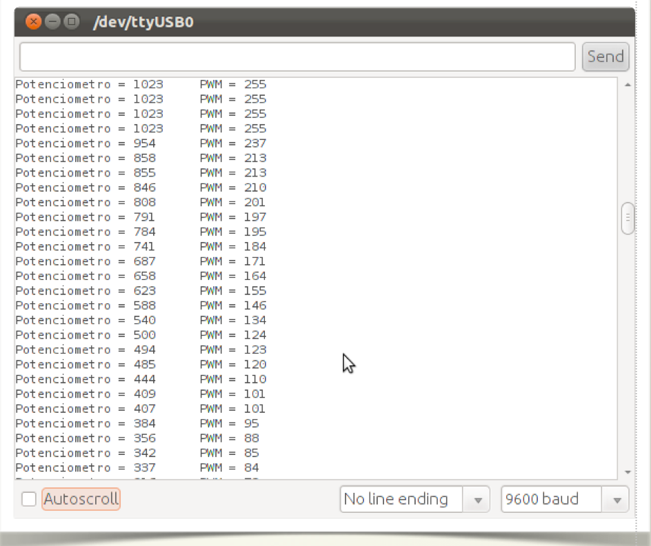

# Montaje 5: Control de la intensidad de iluminación de un LED 

Como ejemplo práctico de la señal PWM vamos a realizar un control de iluminación  sobre un diodo led.

## Sin EDUBASICA

En una protoboard montamos el circuito formado por el **potenciómetro **conectado a la entrada analógica A0.



y también montamos el circuito conectado al pin digital D3, utilizado como salida PWM, de esta manera nos va a permitir variar la luminosidad del LED.



## CON EDUBÁSICA

En este caso ya tiene integrado un potenciómetro conectado a la entrada A0.



Y vamos a utilizar de salida el diodo verde conectado a D3 y a una resistencia ya integrado en EDUBASICA:



## Continuamos... 

Vamos a ver una pequeña demostración:

####ATENCIÓN YOUTUBE HA BORRADO EL VÍDEO, PROCURAREMOS VOLVERLO A REEMPLAZAR TAN PRONTO COMO PODAMOS

Cargamos el programa ejemplo, en la placa Arduino y teniendo acoplada la placa EduBásica o montados los circuitos en una placa protoboard, podemos ver su funcionamiento.

 Para ver su funcionamiento activamos el monitor serie del IDE de programación y variamos el potenciómetro. El resultado es una variación de luminosidad y variación de valores en el monitor serie.

 El siguiente gráfico es una pantalla del monitor serie con los valores leídos y el valor aplicado a la señal PWM para variar la luminosidad.



```cpp+lineNumbers:true
/*Lee la entrada analogica A0, mapea el resultado al rango de 0 a 255 
y utiliza el resutado para poner la anchura del pulso PWM.
 Tambien se escribe en el monitor serie el valor binario de A0 y
 el valor mapeado para la señal PWM.
 De esta manera controlamos la luminosidad del led verde
 de la placa Edubasica
 
 El circuito:
 * potenciometro conectado a la entrada analogica A0.
   Terminal central del potenciometro a pin A0.
   Resto de terminales del potenciometro a +5V y masa
 * Circuito de LED verde conectado a D3-PWM.
 */

// pines usados:
const int analogInPin = A0;  // Entrada analogica A0 del potenciometro
const int analogOutPin = 3; // Salida PWM

int potValor = 0;        // valor de lectura del potenciometro
int outputValor = 0;     // valor de salida de la señal PWM 

void setup() {
  // inicializacion del monitor serie a 9600 bps:
  Serial.begin(9600); 
}

void loop() {
  // lee el valor de la entrada analogica:
  potValor = analogRead(analogInPin);            
  // mapea el rango para la señal de salida PWM:
  outputValor = map(potValor, 0, 1023, 0, 255);  
  // asigna el valor cambiado a pin 3 PWM:
  analogWrite(analogOutPin, outputValor);           

  // escribe el resultado en el monitor serie:
  Serial.print("Potenciometro = " );                       
  Serial.print(potValor);      
  Serial.print("\t PWM = ");      
  Serial.println(outputValor);   

  // espera 1 segundo cada bucle para una visualizacion aceptable
  // conviene tener un valor aunque sea pequeño (10ms)
  // por el proceso de conversion de A/D
  delay(10);                     
}
```

