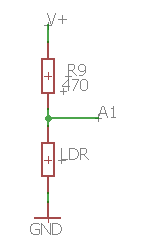

# Montaje 5: LDR con EDUBASICA

Hasta ahora hemos trabajado con resistencias de valor fijo, pero existen una serie de resistencias que varían según distintos parámetros físicos a las que se les somete como presión, luz y temperatura entre otros. Existe una gran variedad que se utilizan para construir lo que llamamos sensores. En esta práctica vamos a diseñar un circuito que sea sensible a la luz. El objetivo será regular la intensidad luminosa de un led con una LDR, una resistencia sensible a la luz.

En este montaje usaremos la resistencia LDR de la placa Edubásica. Como ya hemos comentado, la LDR modifica su resistencia en dependiendo de la cantidad de luz que incida sobre ella. El siguiente programa mostrará por consola (“Monitor Serial”) las variaciones de luminosidad que detecte la LDR simplemente pasando la mano por encima de ella.

https//www.youtube.com/watch?v=APpJGAgetVo?rel=0



Como vemos en el esquema, el LDR está conectado a la entrada A1 del Arduino, por lo tanto la instrucción de lectura será **_analogRead(1)_** lo mapearemos correctamente a una variable llamada **luz** y utilizaremos el LED Verde conectado a D3 por lo que la instrucción de salida será **analogWrite(3,luz)**

```cpp
//Detectamos la variación en la LDR

 int luz;
void setup() {                 
  // Pin 3 tiene el led verde
  pinMode(3, OUTPUT);  
  Serial.begin(9600);
}
void loop() {
  luz= map(analogRead(1), 917, 1024, 0, 255);
  analogWrite(3,luz);
  //escribimos el valor obtenido por la resistencia para ajustarlo
  Serial.print("valor analogico leido=");
  Serial.println(analogRead(1));
  delay (1000);
}
```