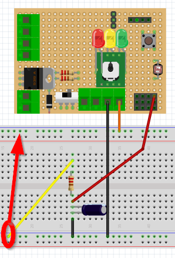
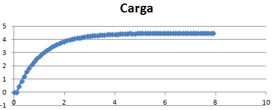

# Montaje 8: Carga de un condensador

El objetivo de esta práctica es **visualizar la carga de un condensador** aprovechando que Arduino puede leer los valores y podemos transmitirlo al ordenador por el puerto serie, usaremos el Arduino como una **capturadora de datos** y así de forma pedagógica enseñamos cómo es la carga.

## SIN EDUBÁSICA

Hacemos una carga del condensador moviendo el cable rojo curvo desde masa a la alimentación. La unión entre resistencia y condensador lo conectamos a A5.


**OJO**: LA PATA (-) DEL CONDENSADOR TIENE QUE IR A GND (peligro de explosión si el condensador es electrolítico y si es muy grande)

El cable <span style="background-color:yellow">amarillo</span> inicialmente lo conectamos a GND y luego procederemos a cargar el condensador soltandolo de GND y conectándolo a 5V

El cable <span style="background-color:red">rojo</span> mide la tensión del condensador y lo mapearemos por A5 del Arduino.

##CON EDUCASICA


(realmente la EDUBASICA en esta práctica no simplifica el cableado)



##Continuamos ....

Y ejecutamos el siguiente código:

```cpp+lineNumbers:true
float sensorPin = A5;    
float sensorValue = 0;  

void setup() {
 
  Serial.begin(9600);  
}

void loop() {
  sensorValue = analogRead(sensorPin); 
  sensorValue = sensorValue/204.6;   //lo mapeamos a Voltios
  Serial.println(sensorValue);
  delay(100);  
}
```

Por el monitor serie se van visualizando los valores, ver el vídeo:

https//www.youtube.com/watch?v=b3ERgTsZ3bo?rel=0

La ventaja de utilizar el Arduino, y no el polímetro, es que podemos copiar los valores y pegarlos en una hoja de cálculo, y así visualizar la curva de carga del condensador:



En este caso, se ha utilizado una resistencia de **100k** y un condensador de **10uF **por lo tanto el tiempo de carga es T= 5RC = 5 seg que es lo que aproximadamente refleja la gráfica. En tu kit de robótica para hacer este curso tienes unos valores parecidos.

> Nota con los valores X: Como la instrucción delay se ha puesto el valor delay(100) por lo tanto hay 0.1segundo entre número y numero, por lo tanto los valores de la X tienen que ser 0, 0.1, 0.2, 0.3 ... en la hoja de cálculo, en la casilla A3 es = A2+0.1 y A1 tiene el valor inicial 0 segundos.

> Nota con los valores Y: Si se pega los valores en una hoja de cálculo, no interpreta el caracter "." como una "," por lo que se aconseja utilizar una columna que convierta estos valores con la función en Excell, por ejemplo el valor en B2 puede ser : =VALOR(REEMPLAZAR(C2;2;1;",")) donde C es la columna donde se pegan los valores del monitor serie.

> La hoja Excell que se ha utilizado te lo puedes descargar [aquí](http://aularagon.catedu.es/materialesaularagon2013/Arduino-codigo/3_Electronica_analogica/calculo_carga.xlsx)


